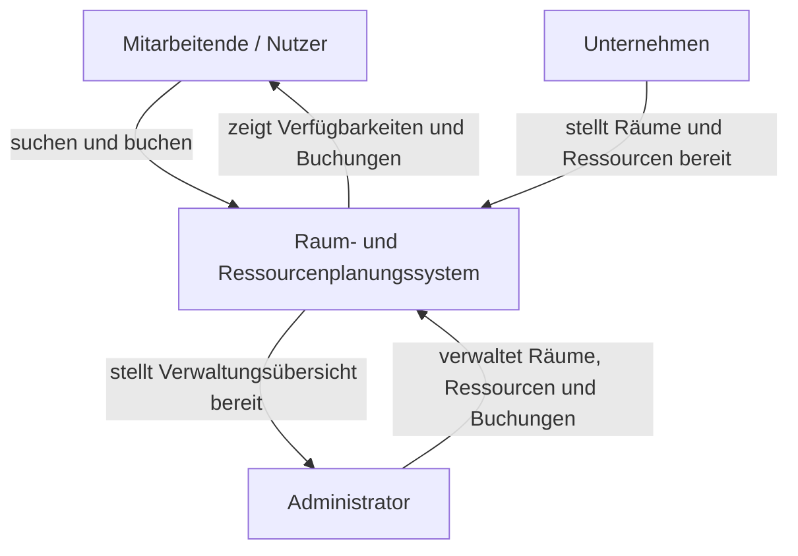

# Fallstudie_Software_Engineering_G03

In diesem REPO wird die Fallstudie für Gruppe 3 im Modul **Fallstudie Software Engineering** bearbeitet.

## Teilnehmer

- Tim-Oliver Strauß
- Florian Haentjes
- Denis Nickel
- Alexander Vetrenko

## GitHub

- Wir nutzen hauptsächlich zur Bearbeitung den Branch `G03`.
- Es wird ein Pull Request erstellt, wenn eine Aufgabe fertig ist.
- Die Arbeitsteilung halten wir in `TASKS.md` fest.
- Anforderungen, Dokumentation, Setup-Hinweise und Tests werden im Repository gepflegt.
- Fertige oder geplante Aufgaben werden zusätzlich als GitHub Issues dokumentiert.

## Rollenverteilung

| Rolle | Verantwortliche Person | Aufgaben |
|---|---|---|
| Projektmanager / Scrum Master | Florian Haentjes | Koordination, Zeitplanung, Sprint Planning, Review & Retrospective |
| Requirements Engineer | Alexander Vetrenko | Anforderungen, User Stories, Stakeholderanalyse, Scoping Document |
| Backend-Entwicklung | Tim-Oliver Strauß | Datenmodell, Geschäftslogik, Buchungslogik, Schnittstellen |
| Frontend-Entwicklung / UX | Denis Nickel | Benutzeroberfläche, Nutzerführung, Darstellung der Buchungen |
| Quality Assurance | gesamtes Team | Tests, Code Reviews, Fehlerprüfung, Dokumentation der Qualität |

> Hinweis: Die Rollen dienen als Hauptverantwortlichkeiten. Die Umsetzung erfolgt gemeinsam im Team.

## Themenauswahl

- [ ] Lernplaner für Studierende
- [ ] Essensplaner für verschiedene Zielgruppen
- [x] Raum‑ und Ressourcenplanung für Unternehmen
- [ ] Aktivitäten und Habit‑Tracker für Fitness‑ und Gesundheitsbewusste
- [ ] Gerätemanagement‑Plattform für Unternehmen

# Raum- und Ressourcenplanung für Unternehmen

## Kurzbeschreibung

Das Ziel des Projekts ist die Entwicklung eines webbasierten Tools, das Unternehmen dabei unterstützt, Räume und Ressourcen effizient zu planen, zu buchen und zu verwalten.

Das System soll Mitarbeitenden ermöglichen, verfügbare Räume, Arbeitsplätze und Ressourcen schnell zu finden und für bestimmte Zeiträume zu buchen. Gleichzeitig soll ein Admin-Bereich bereitgestellt werden, in dem Räume, Ressourcen und Buchungen zentral verwaltet werden können.

## Ausgangssituation

In vielen Unternehmen werden Räume, Arbeitsplätze und Ressourcen über verschiedene Kanäle wie E-Mail, Kalender, Tabellen oder persönliche Absprachen verwaltet. Dadurch können Doppelbuchungen, unklare Zuständigkeiten oder unnötiger organisatorischer Aufwand entstehen.

Das geplante System soll diesen Prozess vereinfachen und eine zentrale Plattform bereitstellen, über die Buchungen transparent, nachvollziehbar und effizient durchgeführt werden können.

## Ziel des Systems

Das System soll folgende Ziele erfüllen:

- zentrale Verwaltung von Räumen, Arbeitsplätzen und Ressourcen
- einfache Buchung durch Mitarbeitende
- Vermeidung von Doppelbuchungen
- Übersicht über eigene Buchungen
- administrative Verwaltung von Räumen, Ressourcen und Buchungen
- nachvollziehbare und benutzerfreundliche Planung
- einfache Bedienbarkeit über eine Weboberfläche

## Beispiele für Räume und Ressourcen

### Räume

- Meetingräume
- Konferenzräume
- Arbeitsplätze
- Sitzplätze in Großraumbüros
- Projekträume
- Schulungsräume

Beispiel: `Raum 1001, Platz 23 [1001-23]`

### Ressourcen

- Beamer
- Whiteboards
- Laptops
- Monitore
- Adapter
- Moderationsmaterial
- Präsentationstechnik

# Lastenheft / Grobanforderungen

## Auftraggeber

Der Auftraggeber bzw. Kunde ist im Rahmen der Fallstudie der Dozent. Das Entwicklungsteam der Gruppe 03 setzt die Anforderungen im Rahmen des Software-Engineering-Projekts um.

## Zielgruppe

Die Anwendung richtet sich an Unternehmen, die Räume, Arbeitsplätze und Ressourcen intern planen und verwalten möchten.

Die wichtigsten Nutzergruppen sind:

- Mitarbeitende, die Räume oder Ressourcen buchen möchten
- Administratoren, die Räume, Ressourcen und Buchungen verwalten
- Unternehmen bzw. Abteilungen, die eine bessere Übersicht über verfügbare Kapazitäten benötigen

## Stakeholderanalyse

| Stakeholder | Interesse / Erwartung |
|---|---|
| Mitarbeitende | möchten schnell und einfach Räume oder Ressourcen buchen |
| Administratoren / Facility Management | möchten Räume, Ressourcen und Buchungen zentral verwalten |
| Unternehmen | möchte Ressourcen effizient nutzen und organisatorischen Aufwand reduzieren |
| IT-Abteilung | möchte eine wartbare und nachvollziehbare Anwendung |
| Entwicklungsteam | möchte ein funktionsfähiges und gut dokumentiertes System entwickeln |
| Dozent / Kunde | erwartet ein nachvollziehbares Projekt mit Anforderungen, Umsetzung, Dokumentation und lauffähiger Software |

## Kontextdiagramm



## Funktionale Anforderungen

### Benutzerverwaltung

- Das System soll Nutzern ermöglichen, sich anzumelden.
- Jeder Nutzer soll ein eigenes Profil besitzen.
- Nutzer sollen ihre eigenen Buchungen einsehen können.
- Das System soll mindestens zwei Rollen unterscheiden:
  - normaler Nutzer
  - Administrator

### Raumverwaltung

- Administratoren sollen Räume anlegen können.
- Administratoren sollen Räume bearbeiten können.
- Administratoren sollen Räume löschen können.
- Zu einem Raum sollen Informationen gespeichert werden können, z.B.:
  - Raumname
  - Raumnummer
  - Kapazität
  - Standort
  - Ausstattung
  - Beschreibung
- Nutzer sollen Räume anzeigen können.
- Nutzer sollen Räume nach Verfügbarkeit suchen können.

### Ressourcenverwaltung

- Administratoren sollen Ressourcen anlegen können.
- Administratoren sollen Ressourcen bearbeiten können.
- Administratoren sollen Ressourcen löschen können.
- Zu einer Ressource sollen Informationen gespeichert werden können, z.B.:
  - Name
  - Typ
  - Beschreibung
  - Verfügbarkeit
  - Standort
- Nutzer sollen verfügbare Ressourcen anzeigen können.
- Nutzer sollen Ressourcen für einen bestimmten Zeitraum buchen können.

### Buchungsverwaltung

- Nutzer sollen Räume für einen bestimmten Zeitraum buchen können.
- Nutzer sollen Ressourcen für einen bestimmten Zeitraum buchen können.
- Das System soll prüfen, ob ein Raum oder eine Ressource im gewünschten Zeitraum verfügbar ist.
- Das System soll Doppelbuchungen verhindern.
- Nutzer sollen ihre eigenen Buchungen stornieren können.
- Nutzer sollen ihre eigenen Buchungen einsehen können.
- Administratoren sollen alle Buchungen einsehen können.
- Administratoren sollen Buchungen bearbeiten oder löschen können.

### Such- und Filterfunktionen

- Nutzer sollen Räume nach Datum und Uhrzeit suchen können.
- Nutzer sollen Ressourcen nach Datum und Uhrzeit suchen können.
- Nutzer sollen Räume nach Eigenschaften filtern können, z.B. Kapazität oder Ausstattung.
- Nutzer sollen Ressourcen nach Typ filtern können.

### Admin-Bereich

- Administratoren sollen Zugriff auf einen geschützten Admin-Bereich haben.
- Im Admin-Bereich sollen Räume verwaltet werden können.
- Im Admin-Bereich sollen Ressourcen verwaltet werden können.
- Im Admin-Bereich sollen Buchungen verwaltet werden können.
- Administratoren sollen eine Übersicht über aktuelle und zukünftige Buchungen erhalten.

## Nicht-funktionale Anforderungen

### Benutzerfreundlichkeit

- Die Benutzeroberfläche soll einfach und intuitiv bedienbar sein.
- Wichtige Funktionen sollen mit wenigen Klicks erreichbar sein.
- Fehlermeldungen sollen verständlich formuliert sein.
- Die Anwendung soll eine übersichtliche Darstellung von Räumen, Ressourcen und Buchungen bieten.

### Zuverlässigkeit

- Das System soll Doppelbuchungen zuverlässig verhindern.
- Buchungen sollen dauerhaft gespeichert werden.
- Fehlerhafte Eingaben sollen erkannt und abgefangen werden.
- Das System soll dem Nutzer Rückmeldung geben, ob eine Buchung erfolgreich war.

### Wartbarkeit

- Der Quellcode soll nachvollziehbar strukturiert sein.
- Funktionen sollen sinnvoll benannt und dokumentiert werden.
- Änderungen am System sollen möglichst einfach durchgeführt werden können.
- Die Projektstruktur soll im Repository nachvollziehbar sein.

### Testbarkeit

- Wichtige Funktionen sollen durch Tests überprüfbar sein.
- Tests sollen im Ordner `tests/` abgelegt werden.
- Die Tests sollen mit `pytest` ausgeführt werden können.
- Besonders die Buchungslogik und die Verhinderung von Doppelbuchungen sollen getestet werden.

### Portabilität und Installation

- Die Anwendung soll auf verschiedenen Rechnern ausführbar sein.
- Abhängigkeiten sollen in der Datei `requirements.txt` dokumentiert werden.
- Die Installation soll über `pip install -r requirements.txt` möglich sein.
- Die Ausführung der Anwendung soll im README beschrieben werden.

### Sicherheit

- Der Admin-Bereich soll nur für Administratoren zugänglich sein.
- Nutzer sollen nur ihre eigenen Buchungen bearbeiten oder stornieren können.
- Eingaben sollen validiert werden.
- Sensible Daten sollen nicht unnötig offengelegt werden.

## User Stories

Die Anforderungen werden zusätzlich als GitHub Issues gepflegt. Erste User Stories:

1. Als Nutzer möchte ich mich anmelden können, damit meine Buchungen meinem Profil zugeordnet werden.
2. Als Nutzer möchte ich verfügbare Räume anzeigen können, damit ich einen passenden Raum finde.
3. Als Nutzer möchte ich Räume nach Datum und Uhrzeit suchen können, damit ich nur verfügbare Räume sehe.
4. Als Nutzer möchte ich einen Raum buchen können, damit ich ihn für ein Meeting reservieren kann.
5. Als Nutzer möchte ich Ressourcen buchen können, damit ich benötigte Ausstattung reservieren kann.
6. Als Nutzer möchte ich meine eigenen Buchungen einsehen können, damit ich den Überblick behalte.
7. Als Nutzer möchte ich meine Buchungen stornieren können, damit ich nicht mehr benötigte Reservierungen freigeben kann.
8. Als Administrator möchte ich Räume anlegen, bearbeiten und löschen können, damit die Raumdaten aktuell bleiben.
9. Als Administrator möchte ich Ressourcen anlegen, bearbeiten und löschen können, damit die Ressourcendaten aktuell bleiben.
10. Als Administrator möchte ich alle Buchungen einsehen können, damit ich die Auslastung kontrollieren kann.
11. Als System möchte ich Doppelbuchungen verhindern, damit Räume und Ressourcen nicht mehrfach zur gleichen Zeit reserviert werden.
12. Als Nutzer möchte ich verständliche Fehlermeldungen erhalten, damit ich fehlerhafte Eingaben korrigieren kann.

## Priorisierung der Anforderungen

### Muss-Anforderungen

- Nutzer können Räume anzeigen.
- Nutzer können Räume buchen.
- Nutzer können eigene Buchungen einsehen.
- Administratoren können Räume verwalten.
- Das System verhindert Doppelbuchungen.
- Die Anwendung ist über den Browser nutzbar.
- Die Installation ist dokumentiert.

### Soll-Anforderungen

- Nutzer können Ressourcen buchen.
- Nutzer können eigene Buchungen stornieren.
- Administratoren können Ressourcen verwalten.
- Such- und Filterfunktionen sind vorhanden.
- Es gibt grundlegende Tests.

### Kann-Anforderungen

- Kalenderansicht für Buchungen
- Exportfunktion für Buchungsübersichten
- Benachrichtigungen bei Buchungen oder Änderungen
- Erweiterte Statistiken zur Raumauslastung
- Responsive Optimierung für mobile Geräte

## Risiken

| Risiko | Auswirkung | Gegenmaßnahme |
|---|---|---|
| Doppelbuchungen werden nicht korrekt verhindert | hohe Fehleranfälligkeit im Kernprozess | Buchungslogik früh entwickeln und testen |
| Zu großer Funktionsumfang | Projekt wird nicht rechtzeitig fertig | Muss-, Soll- und Kann-Anforderungen priorisieren |
| Unklare Aufgabenverteilung | Verzögerungen im Team | Rollen und Aufgaben in `TASKS.md` festhalten |
| Technische Probleme bei der Installation | Anwendung läuft nicht auf anderen Rechnern | `requirements.txt` und Setup-Anleitung pflegen |
| Fehlende Tests | Fehler bleiben unentdeckt | zentrale Funktionen mit `pytest` testen |

## Abgrenzung

Das System ist kein vollständiges Enterprise-Resource-Planning-System. Der Fokus liegt auf der Verwaltung und Buchung von Räumen, Arbeitsplätzen und Ressourcen.

Nicht im Fokus der ersten Version stehen:

- automatische Kalenderintegration
- E-Mail-Benachrichtigungen
- Single-Sign-On
- komplexe Rechteverwaltung
- Abrechnungssysteme
- mobile App

## Geplante technische Umsetzung

Die genaue technische Umsetzung kann im Projektverlauf angepasst werden. Geplant ist eine webbasierte Anwendung mit:

- Python als Programmiersprache
- Weboberfläche im Browser
- Speicherung der Daten in einer einfachen Datenbank oder Datei
- Tests mit `pytest`
- Dokumentation im GitHub-Repository

# Ausführung des Programms

## Installation

Repository klonen oder herunterladen.

Abhängigkeiten installieren:

```bash
pip install -r requirements.txt
```

## Start des Programms

Start des Programms durch:

```bash
python3 <STARTDATEI>.py
```

Beispiel, falls die Startdatei später `app.py` heißt:

```bash
python3 app.py
```

Das Programm startet anschließend im Browser unter:

```text
http://[IP_ADDRESS]
```

oder lokal unter:

```text
http://localhost:5000
```

> Hinweis: Die konkrete Startdatei wird nach der technischen Umsetzung angepasst.

# Testen

Die zu testenden Dateien werden im Ordner `tests/` abgelegt.

Tests ausführen:

```bash
pytest
```

Wichtige Testfälle:

- Raum kann erfolgreich gebucht werden.
- Ressource kann erfolgreich gebucht werden.
- Doppelbuchung wird verhindert.
- Nutzer kann eigene Buchungen einsehen.
- Nutzer kann eigene Buchung stornieren.
- Administrator kann Räume verwalten.
- Administrator kann Ressourcen verwalten.
