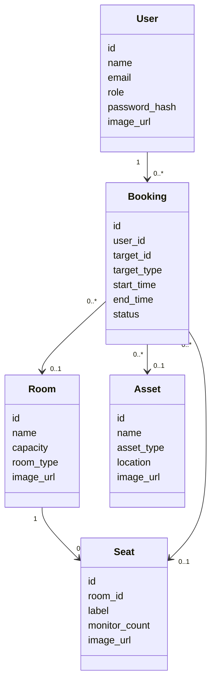

# Kundendokumentation und Fallstudienreflexion RePlan

**Projekt:** RePlan Workspace  
**Stand:** 02.08.2026  
**Grundlage:** Lastenheft und Konzeptionsplan in [`2_Konzeptionsplan.md`](https://github.com/TimBoj23/Fallstudie_Software_Engineering_G03/blob/main/docs/2_Konzeptionsplan.md)

Dieses Handout bündelt die Dokumentation für den Kunden und die Fallstudie. Es zeigt zuerst den fachlichen Nutzen der Anwendung und ordnet danach Source Code, Architektur, Datenbank, Anforderungen, Qualitätssicherung, Projektmanagement und persönliche Reflexion ein.

---

## 1. Dokumentation für den Kunden

### 1.1 Ziel und Nutzen

RePlan ist eine webbasierte Anwendung zur Buchung und Verwaltung von Räumen, Sitzplätzen in Shared Offices und Ausstattung. Ziel ist, Buchungsprozesse zentral abzubilden, Verfügbarkeiten transparent zu machen und Doppelbuchungen zu verhindern.

Für den Kunden stehen drei Fragen im Vordergrund:

- Welche Objekte können gebucht werden?
- Wie wird verhindert, dass Buchungen kollidieren?
- Wie behalten Nutzer und Administratoren den Überblick?

### 1.2 Funktionen für Nutzer

- Registrierung, Login und Logout
- eigenes Profil mit Name, E-Mail, Passwort und Profilbild
- Passwort-vergessen-/Passwort-zurücksetzen-Funktion
- Übersicht über Räume, Shared Offices/Sitzplätze und Ausstattung
- Suche und Filterung nach Objekttyp, Zeitraum und Verfügbarkeit
- Buchung ganzer Räume
- Buchung eines konkreten Sitzplatzes
- automatische Sitzplatzzuweisung, wenn kein Sitzplatz ausgewählt wird
- Buchung von Assets wie Beamer, Laptop oder Whiteboard
- Kalender- und Zeitblockansicht für buchbare Objekte
- eigene Buchungen anzeigen, filtern, bearbeiten, verlängern, kopieren und stornieren
- Buchungshistorie nach Datum und Objekttyp
- Einladungen per manuell teilbarem Code oder Link
- Check-in und Check-out, inklusive QR-Code-Unterstützung
- iCalendar-Export
- Favoriten, Dark Mode und In-App-Benachrichtigungen

### 1.3 Funktionen für Administratoren

- geschützter Adminbereich
- Verwaltung von Räumen, Sitzplätzen und Assets
- Verwaltung aller Buchungen
- Anzeige, von wem eine Buchung stammt
- Nutzerverwaltung mit Profilbildanzeige
- Nutzer anlegen und bearbeiten
- Rollen ändern
- Passwörter zentral zurücksetzen
- Belegungs-, Statistik- und Audit-Ansichten
- Demo-Reset für reproduzierbare Präsentationsdaten

### 1.4 Kurzanleitung für die lokale Nutzung

Die Anwendung besteht aus Backend und Frontend. Beide Teile werden getrennt gestartet.

Backend:

```bash
python3 -m venv .venv
source .venv/bin/activate
pip install -r requirements.txt
python src/main.py
```

Frontend:

```bash
cd frontend
npm install
npm run dev
```

Wichtige Dateien:

- [`README.md`](https://github.com/TimBoj23/Fallstudie_Software_Engineering_G03/blob/main/README.md#fallstudie-software-engineering--gruppe-03)
- [`requirements.txt`](https://github.com/TimBoj23/Fallstudie_Software_Engineering_G03/blob/main/requirements.txt)
- [`frontend/package.json`](https://github.com/TimBoj23/Fallstudie_Software_Engineering_G03/blob/main/frontend/package.json)
- [`src/main.py`](https://github.com/TimBoj23/Fallstudie_Software_Engineering_G03/blob/main/src/main.py)

### 1.5 Lastenheft gegen implementierte Funktionen

| Lastenheft-Anforderung | Umsetzungsstand | Relevante GitHub-Dateien |
| --- | --- | --- |
| Räume sollen verwaltet werden können. | umgesetzt: Räume sind modelliert, werden gespeichert, per API ausgeliefert und im Adminbereich verwaltet | [`src/models/room.py`](https://github.com/TimBoj23/Fallstudie_Software_Engineering_G03/blob/main/src/models/room.py), [`src/services/room_service.py`](https://github.com/TimBoj23/Fallstudie_Software_Engineering_G03/blob/main/src/services/room_service.py), [`src/routes/room_routes.py`](https://github.com/TimBoj23/Fallstudie_Software_Engineering_G03/blob/main/src/routes/room_routes.py), [`frontend/src/pages/Admin.jsx`](https://github.com/TimBoj23/Fallstudie_Software_Engineering_G03/blob/main/frontend/src/pages/Admin.jsx) |
| Ressourcen sollen erfassbar sein. | umgesetzt: Assets sind eigener Objekttyp mit Anzeige, Filterung, Buchung und Verwaltung | [`src/models/asset.py`](https://github.com/TimBoj23/Fallstudie_Software_Engineering_G03/blob/main/src/models/asset.py), [`src/services/asset_service.py`](https://github.com/TimBoj23/Fallstudie_Software_Engineering_G03/blob/main/src/services/asset_service.py), [`src/routes/asset_routes.py`](https://github.com/TimBoj23/Fallstudie_Software_Engineering_G03/blob/main/src/routes/asset_routes.py), [`frontend/src/pages/Assets.jsx`](https://github.com/TimBoj23/Fallstudie_Software_Engineering_G03/blob/main/frontend/src/pages/Assets.jsx) |
| Nutzer sollen Räume und Ressourcen anzeigen können. | umgesetzt: getrennte Übersichten für Räume, Shared Offices und Ausstattung | [`frontend/src/pages/Rooms.jsx`](https://github.com/TimBoj23/Fallstudie_Software_Engineering_G03/blob/main/frontend/src/pages/Rooms.jsx), [`frontend/src/pages/Availability.jsx`](https://github.com/TimBoj23/Fallstudie_Software_Engineering_G03/blob/main/frontend/src/pages/Availability.jsx), [`frontend/src/pages/Assets.jsx`](https://github.com/TimBoj23/Fallstudie_Software_Engineering_G03/blob/main/frontend/src/pages/Assets.jsx), [`frontend/src/api/roomsApi.js`](https://github.com/TimBoj23/Fallstudie_Software_Engineering_G03/blob/main/frontend/src/api/roomsApi.js), [`frontend/src/api/assetsApi.js`](https://github.com/TimBoj23/Fallstudie_Software_Engineering_G03/blob/main/frontend/src/api/assetsApi.js) |
| Verfügbarkeiten sollen prüfbar sein. | umgesetzt: Verfügbarkeit wird im Backend berechnet und im Frontend mit Kalender-/Zeitblockansichten dargestellt | [`src/services/booking_service.py`](https://github.com/TimBoj23/Fallstudie_Software_Engineering_G03/blob/main/src/services/booking_service.py), [`src/repositories/booking_repository.py`](https://github.com/TimBoj23/Fallstudie_Software_Engineering_G03/blob/main/src/repositories/booking_repository.py), [`frontend/src/components/ObjectCalendar.jsx`](https://github.com/TimBoj23/Fallstudie_Software_Engineering_G03/blob/main/frontend/src/components/ObjectCalendar.jsx), [`frontend/src/utils/calendar.js`](https://github.com/TimBoj23/Fallstudie_Software_Engineering_G03/blob/main/frontend/src/utils/calendar.js) |
| Räume oder Ressourcen sollen buchbar sein. | umgesetzt: Räume, Sitzplätze und Assets können gebucht werden | [`frontend/src/pages/CreateBooking.jsx`](https://github.com/TimBoj23/Fallstudie_Software_Engineering_G03/blob/main/frontend/src/pages/CreateBooking.jsx), [`frontend/src/api/bookingsApi.js`](https://github.com/TimBoj23/Fallstudie_Software_Engineering_G03/blob/main/frontend/src/api/bookingsApi.js), [`src/routes/booking_routes.py`](https://github.com/TimBoj23/Fallstudie_Software_Engineering_G03/blob/main/src/routes/booking_routes.py), [`src/services/booking_service.py`](https://github.com/TimBoj23/Fallstudie_Software_Engineering_G03/blob/main/src/services/booking_service.py) |
| Buchungskonflikte sollen erkannt werden. | umgesetzt: Überschneidungen werden zentral im BookingService geprüft | [`src/services/booking_service.py`](https://github.com/TimBoj23/Fallstudie_Software_Engineering_G03/blob/main/src/services/booking_service.py), [`src/models/booking.py`](https://github.com/TimBoj23/Fallstudie_Software_Engineering_G03/blob/main/src/models/booking.py) |
| Doppelbuchungen sollen verhindert werden. | umgesetzt: Räume, Assets und Sitzplätze werden gegen parallele Buchungen geprüft; zusätzlich kann ein Nutzer nicht mehrere Sitzplätze gleichzeitig buchen | [`src/services/booking_service.py`](https://github.com/TimBoj23/Fallstudie_Software_Engineering_G03/blob/main/src/services/booking_service.py), [`src/repositories/booking_repository.py`](https://github.com/TimBoj23/Fallstudie_Software_Engineering_G03/blob/main/src/repositories/booking_repository.py) |
| Nutzer sollen eigene Buchungen sehen. | umgesetzt: eigene Buchungen werden mit Status, Zeitraum, Ressource und Filtermöglichkeiten angezeigt | [`frontend/src/pages/MyBookings.jsx`](https://github.com/TimBoj23/Fallstudie_Software_Engineering_G03/blob/main/frontend/src/pages/MyBookings.jsx), [`frontend/src/components/BookingCard.jsx`](https://github.com/TimBoj23/Fallstudie_Software_Engineering_G03/blob/main/frontend/src/components/BookingCard.jsx), [`src/routes/booking_routes.py`](https://github.com/TimBoj23/Fallstudie_Software_Engineering_G03/blob/main/src/routes/booking_routes.py) |
| Buchungen sollen stornierbar sein. | umgesetzt: Nutzer und Admins können zulässige Buchungen stornieren; Serien können differenziert behandelt werden | [`src/services/booking_service.py`](https://github.com/TimBoj23/Fallstudie_Software_Engineering_G03/blob/main/src/services/booking_service.py), [`frontend/src/components/BookingEditForm.jsx`](https://github.com/TimBoj23/Fallstudie_Software_Engineering_G03/blob/main/frontend/src/components/BookingEditForm.jsx), [`frontend/src/components/BookingCard.jsx`](https://github.com/TimBoj23/Fallstudie_Software_Engineering_G03/blob/main/frontend/src/components/BookingCard.jsx) |
| Administratoren sollen Räume, Ressourcen und Buchungen verwalten. | umgesetzt: Adminbereich bündelt Räume, Sitzplätze, Assets, Buchungen und Nutzer | [`frontend/src/pages/Admin.jsx`](https://github.com/TimBoj23/Fallstudie_Software_Engineering_G03/blob/main/frontend/src/pages/Admin.jsx), [`src/routes/user_routes.py`](https://github.com/TimBoj23/Fallstudie_Software_Engineering_G03/blob/main/src/routes/user_routes.py), [`src/routes/room_routes.py`](https://github.com/TimBoj23/Fallstudie_Software_Engineering_G03/blob/main/src/routes/room_routes.py), [`src/routes/asset_routes.py`](https://github.com/TimBoj23/Fallstudie_Software_Engineering_G03/blob/main/src/routes/asset_routes.py), [`src/routes/seat_routes.py`](https://github.com/TimBoj23/Fallstudie_Software_Engineering_G03/blob/main/src/routes/seat_routes.py) |
| Rollen und Rechte sollen unterstützt werden. | umgesetzt: Rollen sind im Backend hinterlegt und API-Zugriffe werden geschützt | [`src/models/user.py`](https://github.com/TimBoj23/Fallstudie_Software_Engineering_G03/blob/main/src/models/user.py), [`src/utils/auth_middleware.py`](https://github.com/TimBoj23/Fallstudie_Software_Engineering_G03/blob/main/src/utils/auth_middleware.py), [`src/services/user_service.py`](https://github.com/TimBoj23/Fallstudie_Software_Engineering_G03/blob/main/src/services/user_service.py), [`frontend/src/state/authStore.js`](https://github.com/TimBoj23/Fallstudie_Software_Engineering_G03/blob/main/frontend/src/state/authStore.js) |
| Die Weboberfläche soll verständlich bedienbar sein. | umgesetzt: React/Vite-Frontend mit Navigation, Karten, Formularen, Kalendern, Adminbereich und Buchungshistorie | [`frontend/src/App.jsx`](https://github.com/TimBoj23/Fallstudie_Software_Engineering_G03/blob/main/frontend/src/App.jsx), [`frontend/src/components/AppShell.jsx`](https://github.com/TimBoj23/Fallstudie_Software_Engineering_G03/blob/main/frontend/src/components/AppShell.jsx), [`frontend/src/components/ResourceCard.jsx`](https://github.com/TimBoj23/Fallstudie_Software_Engineering_G03/blob/main/frontend/src/components/ResourceCard.jsx), [`frontend/src/styles/`](https://github.com/TimBoj23/Fallstudie_Software_Engineering_G03/tree/main/frontend/src/styles) |
| Die Geschäftslogik soll testbar sein. | umgesetzt: Backend- und Frontend-Tests prüfen Buchungslogik, Kalenderlogik, UI-Hilfen und Zeitverarbeitung | [`docs/4_Testdokumentation.md`](https://github.com/TimBoj23/Fallstudie_Software_Engineering_G03/blob/main/docs/4_Testdokumentation.md), [`frontend/src/tests/calendar.test.js`](https://github.com/TimBoj23/Fallstudie_Software_Engineering_G03/blob/main/frontend/src/tests/calendar.test.js), [`frontend/src/tests/bookingUi.test.js`](https://github.com/TimBoj23/Fallstudie_Software_Engineering_G03/blob/main/frontend/src/tests/bookingUi.test.js) |
| Architektur und Entscheidungen sollen dokumentiert werden. | umgesetzt: Konzeptionsplan, UML, Testdokumentation, Abschlussdokumentation und Sprintdokumente liegen vor | [`docs/2_Konzeptionsplan.md`](https://github.com/TimBoj23/Fallstudie_Software_Engineering_G03/blob/main/docs/2_Konzeptionsplan.md), [`docs/3_UML.md`](https://github.com/TimBoj23/Fallstudie_Software_Engineering_G03/blob/main/docs/3_UML.md), [`docs/4_Testdokumentation.md`](https://github.com/TimBoj23/Fallstudie_Software_Engineering_G03/blob/main/docs/4_Testdokumentation.md), [`docs/5_Abschlussdokumentation.md`](https://github.com/TimBoj23/Fallstudie_Software_Engineering_G03/blob/main/docs/5_Abschlussdokumentation.md), [`docs/Sprints/Sprint_III_Umsetzungsplan.md`](https://github.com/TimBoj23/Fallstudie_Software_Engineering_G03/blob/main/docs/Sprints/Sprint_III_Umsetzungsplan.md) |

### 1.6 Sonderfunktionen

Über das ursprüngliche MVP hinaus wurden mehrere Funktionen ergänzt, weil sie die Demo näher an eine reale Unternehmensanwendung bringen:

- Sitzplätze als eigene Entität innerhalb eines Raumes
- automatische Sitzplatzzuweisung
- grafischer Shared-Office-Sitzplan
- Kalenderansicht pro Objekt mit Zeitblöcken
- Regel gegen parallele Sitzplatzbuchungen eines Nutzers
- Nutzerfotos und sichtbare Buchungsbesitzer
- Passwortreset für Nutzer und Admins
- Einladungen mit Code, Link und Passwortschutz
- QR-Code-gestützter Check-in
- iCalendar-Export
- In-App-Benachrichtigungen
- Dark Mode und Favoriten
- Audit-Protokoll
- Demo-Reset und Seed-Daten

### 1.7 Bewusste Grenzen und Roadmap

Für den Prototyp bewusst nicht umgesetzt:

- produktiver E-Mail-Versand
- Single-Sign-On
- externe Kalender-Synchronisierung
- produktive Deployment-Konfiguration
- browserbasierte End-to-End-Tests
- vollständig normalisiertes relationales Datenbankschema

Mögliche Phase 2:

- normalisierte SQL-Tabellen mit Migrationstool
- produktiver Maildienst für Einladungen und Passwortreset
- Deployment mit Umgebungsvariablen, Monitoring und Backups
- E2E-Tests für kritische Nutzerpfade
- Rollen-/Rechtekonzept mit feineren Berechtigungen
- Auslastungsberichte und Exportfunktionen für Administratoren

---

## 2. Entwicklerdokumentation

### 2.1 Source Code und Kommentare

Der Source Code ist nach Verantwortlichkeiten getrennt. Kommentare werden sparsam eingesetzt und dort genutzt, wo fachliche Regeln oder technische Entscheidungen nicht selbsterklärend sind. Die Hauptlogik liegt nicht in langen Kommentaren, sondern in klar benannten Modulen.

Wichtige Bereiche:

| Bereich | Aufgabe | Dateien |
| --- | --- | --- |
| Einstieg Backend | Flask-App starten und Blueprints registrieren | [`src/main.py`](https://github.com/TimBoj23/Fallstudie_Software_Engineering_G03/blob/main/src/main.py) |
| Routen/API | HTTP-Endpunkte, Payloads, Statuscodes, Authentifizierung | [`src/routes/`](https://github.com/TimBoj23/Fallstudie_Software_Engineering_G03/tree/main/src/routes) |
| Services | Geschäftslogik, Buchungsregeln, Konfliktprüfung, Nutzerprozesse | [`src/services/`](https://github.com/TimBoj23/Fallstudie_Software_Engineering_G03/tree/main/src/services) |
| Modelle | Fachliche Entitäten und Datenstrukturen | [`src/models/`](https://github.com/TimBoj23/Fallstudie_Software_Engineering_G03/tree/main/src/models) |
| Repositories | Datenzugriff, Suche, Persistenzabstraktion | [`src/repositories/`](https://github.com/TimBoj23/Fallstudie_Software_Engineering_G03/tree/main/src/repositories) |
| Frontend-Seiten | Nutzer- und Adminansichten | [`frontend/src/pages/`](https://github.com/TimBoj23/Fallstudie_Software_Engineering_G03/tree/main/frontend/src/pages) |
| Frontend-Komponenten | wiederverwendbare UI-Bausteine | [`frontend/src/components/`](https://github.com/TimBoj23/Fallstudie_Software_Engineering_G03/tree/main/frontend/src/components) |
| API-Clients | Verbindung zwischen Frontend und Backend | [`frontend/src/api/`](https://github.com/TimBoj23/Fallstudie_Software_Engineering_G03/tree/main/frontend/src/api) |

### 2.2 Architektur

Die Anwendung nutzt eine getrennte Fullstack-Architektur:

```text
React/Vite-Frontend
        |
        | REST/JSON + Bearer-Token
        v
Flask-Backend mit Blueprints
        |
        v
Service-Schicht
        |
        v
Repository-Schicht
        |
        v
SQLite + JSON-Migration
```

Architekturprinzipien:

- Das Frontend stellt Abläufe dar und ruft API-Endpunkte auf.
- Das Backend ist die zentrale Quelle für Regeln, Rechte und Konfliktprüfung.
- Services kapseln fachliche Entscheidungen.
- Repositories kapseln Datenzugriff und Persistenz.
- Modelle beschreiben Räume, Sitzplätze, Assets, Nutzer und Buchungen.
- SQLite ersetzt JSON als primäre Persistenz im Prototyp.

Ausführlicher beschrieben in [`3_UML.md`](https://github.com/TimBoj23/Fallstudie_Software_Engineering_G03/blob/main/docs/3_UML.md).

### 2.3 Backend / Frontend / Interfaces

#### Backend

Das Backend basiert auf Flask. Die API ist über Blueprints organisiert. Authentifizierung, Rollenprüfung und fachliche Validierung erfolgen serverseitig.

Relevante Dateien:

- [`src/routes/auth_routes.py`](https://github.com/TimBoj23/Fallstudie_Software_Engineering_G03/blob/main/src/routes/auth_routes.py)
- [`src/routes/booking_routes.py`](https://github.com/TimBoj23/Fallstudie_Software_Engineering_G03/blob/main/src/routes/booking_routes.py)
- [`src/routes/user_routes.py`](https://github.com/TimBoj23/Fallstudie_Software_Engineering_G03/blob/main/src/routes/user_routes.py)
- [`src/routes/room_routes.py`](https://github.com/TimBoj23/Fallstudie_Software_Engineering_G03/blob/main/src/routes/room_routes.py)
- [`src/routes/seat_routes.py`](https://github.com/TimBoj23/Fallstudie_Software_Engineering_G03/blob/main/src/routes/seat_routes.py)
- [`src/routes/asset_routes.py`](https://github.com/TimBoj23/Fallstudie_Software_Engineering_G03/blob/main/src/routes/asset_routes.py)
- [`src/utils/auth_middleware.py`](https://github.com/TimBoj23/Fallstudie_Software_Engineering_G03/blob/main/src/utils/auth_middleware.py)

#### Frontend

Das Frontend basiert auf React und Vite. Es ist kein autarker Demonstrator mehr, sondern ruft Backend-Endpunkte über API-Client-Dateien auf.

Relevante Dateien:

- [`frontend/src/App.jsx`](https://github.com/TimBoj23/Fallstudie_Software_Engineering_G03/blob/main/frontend/src/App.jsx)
- [`frontend/src/pages/Dashboard.jsx`](https://github.com/TimBoj23/Fallstudie_Software_Engineering_G03/blob/main/frontend/src/pages/Dashboard.jsx)
- [`frontend/src/pages/CreateBooking.jsx`](https://github.com/TimBoj23/Fallstudie_Software_Engineering_G03/blob/main/frontend/src/pages/CreateBooking.jsx)
- [`frontend/src/pages/MyBookings.jsx`](https://github.com/TimBoj23/Fallstudie_Software_Engineering_G03/blob/main/frontend/src/pages/MyBookings.jsx)
- [`frontend/src/pages/Admin.jsx`](https://github.com/TimBoj23/Fallstudie_Software_Engineering_G03/blob/main/frontend/src/pages/Admin.jsx)
- [`frontend/src/components/ObjectCalendar.jsx`](https://github.com/TimBoj23/Fallstudie_Software_Engineering_G03/blob/main/frontend/src/components/ObjectCalendar.jsx)
- [`frontend/src/api/client.js`](https://github.com/TimBoj23/Fallstudie_Software_Engineering_G03/blob/main/frontend/src/api/client.js)

#### Interfaces

Die Kommunikation erfolgt über REST/JSON. Das Frontend sendet Bearer-Tokens und erhält fachliche Daten als JSON-Antworten zurück.

Beispiele:

- Authentifizierung: [`frontend/src/api/authApi.js`](https://github.com/TimBoj23/Fallstudie_Software_Engineering_G03/blob/main/frontend/src/api/authApi.js) und [`src/routes/auth_routes.py`](https://github.com/TimBoj23/Fallstudie_Software_Engineering_G03/blob/main/src/routes/auth_routes.py)
- Buchungen: [`frontend/src/api/bookingsApi.js`](https://github.com/TimBoj23/Fallstudie_Software_Engineering_G03/blob/main/frontend/src/api/bookingsApi.js) und [`src/routes/booking_routes.py`](https://github.com/TimBoj23/Fallstudie_Software_Engineering_G03/blob/main/src/routes/booking_routes.py)
- Räume: [`frontend/src/api/roomsApi.js`](https://github.com/TimBoj23/Fallstudie_Software_Engineering_G03/blob/main/frontend/src/api/roomsApi.js) und [`src/routes/room_routes.py`](https://github.com/TimBoj23/Fallstudie_Software_Engineering_G03/blob/main/src/routes/room_routes.py)
- Sitzplätze: [`frontend/src/api/seatsApi.js`](https://github.com/TimBoj23/Fallstudie_Software_Engineering_G03/blob/main/frontend/src/api/seatsApi.js) und [`src/routes/seat_routes.py`](https://github.com/TimBoj23/Fallstudie_Software_Engineering_G03/blob/main/src/routes/seat_routes.py)
- Assets: [`frontend/src/api/assetsApi.js`](https://github.com/TimBoj23/Fallstudie_Software_Engineering_G03/blob/main/frontend/src/api/assetsApi.js) und [`src/routes/asset_routes.py`](https://github.com/TimBoj23/Fallstudie_Software_Engineering_G03/blob/main/src/routes/asset_routes.py)

### 2.4 Datenbank

Die Anwendung nutzt SQLite als lokale SQL-Persistenz. Vorhandene JSON-Daten werden einmalig migriert. Die Datenbankdatei selbst wird nicht versioniert, weil sie lokale Laufzeitdaten enthält.

Fachliche Entitäten:



Datenbanknahe Dateien:

- [`src/repositories/base_repository.py`](https://github.com/TimBoj23/Fallstudie_Software_Engineering_G03/blob/main/src/repositories/base_repository.py)
- [`src/repositories/user_repository.py`](https://github.com/TimBoj23/Fallstudie_Software_Engineering_G03/blob/main/src/repositories/user_repository.py)
- [`src/repositories/booking_repository.py`](https://github.com/TimBoj23/Fallstudie_Software_Engineering_G03/blob/main/src/repositories/booking_repository.py)
- [`src/repositories/room_repository.py`](https://github.com/TimBoj23/Fallstudie_Software_Engineering_G03/blob/main/src/repositories/room_repository.py)
- [`src/repositories/seat_repository.py`](https://github.com/TimBoj23/Fallstudie_Software_Engineering_G03/blob/main/src/repositories/seat_repository.py)
- [`src/repositories/asset_repository.py`](https://github.com/TimBoj23/Fallstudie_Software_Engineering_G03/blob/main/src/repositories/asset_repository.py)

---

## 3. Technische Dokumentation

### 3.1 Anforderungen

Die Anforderungen wurden im Konzeptionsplan funktional und nicht-funktional beschrieben. Die wichtigsten funktionalen Anforderungen wurden umgesetzt:

- Räume anzeigen, suchen, filtern, buchen und verwalten
- Assets anzeigen, suchen, filtern, buchen und verwalten
- Sitzplätze in Shared Offices anzeigen, auswählen und buchen
- Buchungskonflikte erkennen und Doppelbuchungen verhindern
- eigene Buchungen anzeigen, bearbeiten und stornieren
- Adminbereich für Nutzer, Rollen, Buchungen und Stammdaten
- einfache rollenbasierte Zugriffskontrolle

Nicht-funktionale Anforderungen:

- verständliche Bedienung über Weboberfläche
- nachvollziehbare Fehlermeldungen
- wartbare Schichtenarchitektur
- testbare Geschäftslogik
- dokumentierte Architektur und Qualitätssicherung
- lokal reproduzierbare Ausführung

Roadmap für Phase 2:

- produktive Datenbankmodellierung
- E-Mail-Integration
- Deployment-Konzept
- E2E-Testabdeckung
- erweiterte Rechteverwaltung
- Auslastungsberichte

### 3.2 Entwurfsdokumente

Die wichtigsten Entwurfsdokumente sind:

- [`2_Konzeptionsplan.md`](https://github.com/TimBoj23/Fallstudie_Software_Engineering_G03/blob/main/docs/2_Konzeptionsplan.md): Projektziel, Stakeholder, Lastenheft, Use Cases, Sprintplanung
- [`3_UML.md`](https://github.com/TimBoj23/Fallstudie_Software_Engineering_G03/blob/main/docs/3_UML.md): Systemkontext, Schichtenmodell, Domänenmodell, Sequenzdiagramm
- [`5_Abschlussdokumentation.md`](https://github.com/TimBoj23/Fallstudie_Software_Engineering_G03/blob/main/docs/5_Abschlussdokumentation.md): Ergebnis, Architektur, Use Cases, Grenzen
- [`Sprints/Sprint_III_Umsetzungsplan.md`](https://github.com/TimBoj23/Fallstudie_Software_Engineering_G03/blob/main/docs/Sprints/Sprint_III_Umsetzungsplan.md): Sprint-III-Ziele und Erweiterungen
- [`Sprints/Qualitaetsbericht.html`](https://github.com/TimBoj23/Fallstudie_Software_Engineering_G03/blob/main/docs/Sprints/Qualitaetsbericht.html): visuelles Qualitätssheet für die Präsentation

### 3.3 QS-Dokumente

Qualitätssicherung wurde über automatische und manuelle Prüfungen dokumentiert.

Automatisierte Prüfungen:

- Backend-Tests mit `pytest`
- Frontend-Tests mit `npm test -- --run`
- Produktions-Build mit `npm run build`

Dokumentierter Prüfstand:

- 97 Backend-Tests bestanden
- 13 Frontend-Tests bestanden
- 110 automatisierte Tests insgesamt
- React-Produktions-Build erfolgreich

Abgedeckte Bereiche:

- Authentifizierung und Rollen
- Buchungslogik und Konfliktprüfung
- Räume, Sitzplätze und Assets
- Suche und Filterung
- Serienbuchungen
- Check-in und Check-out
- Einladungen
- Adminbereich
- Kalender- und Zeitverarbeitung
- Frontend-Hilfslogik

Relevante Dateien:

- [`docs/4_Testdokumentation.md`](https://github.com/TimBoj23/Fallstudie_Software_Engineering_G03/blob/main/docs/4_Testdokumentation.md)
- [`frontend/src/tests/calendar.test.js`](https://github.com/TimBoj23/Fallstudie_Software_Engineering_G03/blob/main/frontend/src/tests/calendar.test.js)
- [`frontend/src/tests/dateTime.test.js`](https://github.com/TimBoj23/Fallstudie_Software_Engineering_G03/blob/main/frontend/src/tests/dateTime.test.js)
- [`frontend/src/tests/theme.test.js`](https://github.com/TimBoj23/Fallstudie_Software_Engineering_G03/blob/main/frontend/src/tests/theme.test.js)
- [`frontend/src/tests/bookingUi.test.js`](https://github.com/TimBoj23/Fallstudie_Software_Engineering_G03/blob/main/frontend/src/tests/bookingUi.test.js)

---

## 4. Projektmanagement-Dokumentation

### 4.1 Projektplan und Rollen

| Rolle | Verantwortliche Person | Aufgaben |
| --- | --- | --- |
| Projektmanagement | Florian Haentjes | Terminüberwachung, Pflege des Zeitplans, Koordination von Meetings, Nachverfolgung offener Aufgaben, Sicherstellung des Projektfortschritts |
| Scrum Master | Tim-Oliver Strauß | Sprint Planning, Review, Retrospective, Unterstützung des iterativen Vorgehens |
| Requirements Engineering / Dokumentation | Alexander Vetrenko | Sammlung und Strukturierung von Anforderungen, Use Cases, User Stories, Anforderungskatalog, Dokumentation fachlicher Entscheidungen |
| Software-Architektur / Systemdesign | gesamtes Team | Entwurf der Systemarchitektur, Modellierung von Komponenten und Datenstrukturen, Definition technischer Schnittstellen |
| Backend-Entwicklung | Alexander Vetrenko & Tim-Oliver Strauß | Umsetzung der Kernfunktionalitäten, Geschäftslogik, Buchungslogik, Schnittstellen |
| Frontend-Entwicklung / UX | Denis Nickel & Florian Haentjes | Benutzeroberfläche, Nutzerführung, Darstellung der Buchungen |
| Qualitätssicherung / Testing | Denis Nickel & Florian Haentjes | Testplanung, Testfälle, Funktionstests, Code Reviews, Fehlerprüfung |

Dokumente:

- [`1_Projekt_Zeitplan.md`](https://github.com/TimBoj23/Fallstudie_Software_Engineering_G03/blob/main/docs/1_Projekt_Zeitplan.md)
- [`2_Konzeptionsplan.md`](https://github.com/TimBoj23/Fallstudie_Software_Engineering_G03/blob/main/docs/2_Konzeptionsplan.md)
- [`Sprints/Sprint_Planung_Vorlage.md`](https://github.com/TimBoj23/Fallstudie_Software_Engineering_G03/blob/main/docs/Sprints/Sprint_Planung_Vorlage.md)
- [`Sprints/Sprint_Review_Vorlage.md`](https://github.com/TimBoj23/Fallstudie_Software_Engineering_G03/blob/main/docs/Sprints/Sprint_Review_Vorlage.md)

### 4.2 Sprints und Epics

| Sprint | Schwerpunkt | Umgesetzte Epics / Ergebnisse |
| --- | --- | --- |
| Sprint I | Grundlage | Thema, Stakeholder, Lastenheft, Rollen, Architekturidee, Domänenmodell, erste Projektstruktur |
| Sprint II | MVP und Integration | REST-API, Login, Buchungen, Räume, Ressourcen, Sitzplatzlogik, Konfliktprüfung, erste Frontend-Anbindung |
| Sprint III | Stabilisierung und Demoqualität | SQLite, JSON-Migration, Adminbereich, Nutzerverwaltung, Bilder, Filter, Kalender, Zeitblöcke, Einladungen, Benachrichtigungen, Tests und Dokumentation |

Sprint-Dokumente:

- [`Sprints/Sprint_I_Architekturentscheidungen.md`](https://github.com/TimBoj23/Fallstudie_Software_Engineering_G03/blob/main/docs/Sprints/Sprint_I_Architekturentscheidungen.md)
- [`Sprints/Sprint_II_Planung.md`](https://github.com/TimBoj23/Fallstudie_Software_Engineering_G03/blob/main/docs/Sprints/Sprint_II_Planung.md)
- [`Sprints/Sprint_III_Umsetzungsplan.md`](https://github.com/TimBoj23/Fallstudie_Software_Engineering_G03/blob/main/docs/Sprints/Sprint_III_Umsetzungsplan.md)
- [`Sprints/Sprint_III_Engineering_Reflexion.md`](https://github.com/TimBoj23/Fallstudie_Software_Engineering_G03/blob/main/docs/Sprints/Sprint_III_Engineering_Reflexion.md)

### 4.3 Abhängigkeiten und Entscheidungen

Wichtige Abhängigkeiten:

- Frontend benötigt stabile API-Endpunkte.
- Buchungsoberflächen hängen von zentraler Backend-Konfliktprüfung ab.
- Adminansichten benötigen vollständige Nutzer-, Buchungs- und Ressourcendaten.
- Demoqualität hängt stark von Seed-Daten, Bildern und einheitlicher lokaler Datenbank ab.

Wichtige Entscheidungen:

- SQLite statt reiner JSON-Dateien
- Backend als Quelle für Buchungsregeln
- Sitzplätze als eigene Entität
- REST/JSON als Schnittstelle
- keine produktive E-Mail-Integration im Prototyp
- Demo-Daten über Seed-Prozess statt manuelle Datenbankpflege

---

## 5. Dokumentation für die Fallstudie

### 5.1 Tim-Oliver Strauß

#### Meine Rolle im Projekt

Tim-Oliver übernahm Scrum-Master-Aufgaben, Backend-Entwicklung und Qualitätsmanagement. Im Projekt bedeutete das vor allem, Sprintplanung und Review vorzubereiten, technische Probleme zu strukturieren und die Backendlogik stabil zu halten.

#### Inhaltliche Beiträge

- Sprint Planning, Review und Retrospektive mit vorbereitet
- Backend-Services und API-Endpunkte geprüft und erweitert
- Buchungslogik, Sitzplatzlogik und Validierungsregeln unterstützt
- Login, Logout und Passwortprozesse stabilisiert
- SQLite-Migration und Datenbankprobleme analysiert
- Dokumente für Sprint, Qualität und Präsentation erstellt oder überarbeitet

#### Positive Erfahrungen

Die zentrale Backendlogik machte es möglich, neue Frontend-Funktionen anzubinden, ohne fachliche Regeln mehrfach zu implementieren. Besonders hilfreich war, Buchungsregeln nicht über UI-Zustände, sondern über Services abzusichern.

#### Schwierigkeiten und Lösungen

Schwierig war die Zusammenführung eines zunächst autarken Frontends mit dem Backend. Gelöst wurde das durch klare API-Clients, konkrete Endpunkte und wiederholte lokale Tests von Backend und Frontend.

#### Fazit

Gelernt wurde vor allem, dass Schnittstellen früh festgelegt werden müssen. Außerdem zeigte sich, dass Demo-Daten und Qualitätssicherung genauso wichtig sind wie der eigentliche Featurecode.

### 5.2 Alexander Vetrenko

#### Meine Rolle im Projekt

Alexander war für Requirements Engineering, Dokumentation und Backend-Entwicklung mitverantwortlich. Sein Schwerpunkt lag darin, aus fachlichen Anforderungen konkrete Use Cases, User Stories und technische Arbeitspakete abzuleiten.

#### Inhaltliche Beiträge

- Anforderungen aus dem Lastenheft strukturiert
- Use Cases und User Stories eingeordnet
- Muss-, Soll- und Kann-Anforderungen priorisiert
- Backend-Modelle und Services fachlich mitgestaltet
- Architektur- und Umsetzungsentscheidungen dokumentiert
- Lastenheft und tatsächliche Umsetzung abgeglichen

#### Positive Erfahrungen

Die Arbeit mit klaren Anforderungen half, den wachsenden Funktionsumfang zu kontrollieren. Besonders die Trennung von Räumen, Assets und Sitzplätzen machte die Fachlogik nachvollziehbarer.

#### Schwierigkeiten und Lösungen

Eine Herausforderung war, Anforderungen nachträglich zu präzisieren, ohne den Projektumfang zu sprengen. Gelöst wurde das über Priorisierung und über die Einordnung zusätzlicher Funktionen als Demo-Erweiterungen.

#### Fazit

Die wichtigste Erkenntnis war, dass Anforderungen nicht statisch bleiben. Entscheidend ist, Änderungen nachvollziehbar zu dokumentieren und in realistische Arbeitspakete zu übersetzen.

### 5.3 Florian Haentjes

#### Meine Rolle im Projekt

Florian übernahm Projektmanagement, Frontend-Entwicklung und GitHub-Issue-Management. Er achtete darauf, offene Aufgaben sichtbar zu halten und die Oberfläche für die Präsentation verständlich zu machen.

#### Inhaltliche Beiträge

- Zeitplan und offene Aufgaben nachverfolgt
- GitHub Issues gepflegt und sprintbezogen eingeordnet
- Frontend-Seiten und Nutzerführung unterstützt
- Darstellungen für Räume, Assets, Sitzplätze und Buchungen mitgestaltet
- Adminoberfläche und Nutzerverwaltung verbessert
- Präsentationsreife der Oberfläche mitbewertet

#### Positive Erfahrungen

Die Oberfläche wurde schrittweise verständlicher, weil technische Details wie IDs aus Nutzersichten entfernt und durch Namen, Bilder, Statusinformationen und Nutzerbezug ersetzt wurden.

#### Schwierigkeiten und Lösungen

Schwierig war die anfänglich eigenständige Frontend-Struktur. Dadurch entstanden Unterschiede zwischen UI-Demo und Backendlogik. Gelöst wurde das durch stärkere API-Anbindung und gemeinsame Abstimmung der Datenstrukturen.

#### Fazit

Florian nahm mit, dass Projektmanagement in Softwareprojekten nicht nur Termine bedeutet. Es geht auch darum, offene fachliche Lücken rechtzeitig sichtbar zu machen und die Umsetzung präsentierbar zu halten.

### 5.4 Denis Nickel

#### Meine Rolle im Projekt

Denis arbeitete an Frontend, UX und Qualitätssicherung. Sein Schwerpunkt lag auf Nutzerführung, visueller Darstellung und manueller Prüfung zentraler Abläufe.

#### Inhaltliche Beiträge

- Frontend-Komponenten und Seitenstruktur unterstützt
- Ressourcen- und Buchungskarten mitgestaltet
- Kalender-, Status- und Filteransichten geprüft
- Nutzerabläufe für Login, Buchung, Stornierung und Adminaktionen getestet
- Rückmeldung zur Verständlichkeit der Oberfläche gegeben
- Qualitätssicherung durch Funktionstests unterstützt

#### Positive Erfahrungen

Die Nutzeroberfläche wurde klarer, als der Fokus auf fachliche Informationen gelegt wurde: Was ist buchbar, wann ist es frei, wer hat gebucht und welche Aktion ist möglich?

#### Schwierigkeiten und Lösungen

Eine Herausforderung war, unterschiedliche Objekttypen einheitlich darzustellen, ohne ihre Unterschiede zu verlieren. Gelöst wurde das durch wiederverwendbare Komponenten und differenzierte Detailinformationen pro Objekttyp.

#### Fazit

Denis lernte, dass UX im Projekt nicht nur Gestaltung bedeutet. Gute Nutzerführung hängt stark davon ab, dass Backenddaten korrekt, verständlich und im richtigen Kontext angezeigt werden.

### 5.5 Teamarbeit

Die Teamarbeit war geprägt von einer klaren Rollenaufteilung, aber auch von notwendigen Überschneidungen. Backend, Frontend und Dokumentation mussten regelmäßig abgeglichen werden, weil Änderungen an Datenmodell oder API direkte Auswirkungen auf die Oberfläche hatten.

Positiv war, dass das Team den Projektumfang in Sprints strukturierte und Probleme Schritt für Schritt löste. Schwieriger war, dass Frontend und Backend zeitweise unterschiedlich weit entwickelt waren. Dadurch musste später Integrationsarbeit nachgeholt werden.

### 5.6 Fachliche Herausforderungen

| Herausforderung | Lösung |
| --- | --- |
| Frontend war zeitweise autark | API-Anbindung über zentrale Client-Dateien und Backend-Endpunkte |
| JSON-Daten reichten für die Demo nicht mehr aus | SQLite-Schicht mit einmaliger JSON-Migration |
| Räume, Assets und Sitzplätze hatten unterschiedliche Regeln | getrennte Entitäten mit gemeinsamer Buchungslogik |
| Doppelbuchungen und parallele Sitzplatzbuchungen | zentrale Konfliktprüfung im Backend |
| technische IDs waren für Nutzer nicht verständlich | Anzeige von Namen, Bildern, Status und Buchungsbesitzern |
| lokale Demo-Daten unterschieden sich im Team | Seed- und Demo-Reset-Logik |
| Zeiträume und Kalenderdarstellung waren fehleranfällig | gemeinsame Zeit- und Kalenderhilfsfunktionen |

### 5.7 Gesamtfazit

RePlan entwickelte sich von einer geplanten Raum- und Ressourcenbuchung zu einer integrierten Fullstack-Demo. Besonders wichtig waren die klare Trennung von Frontend und Backend, die zentrale Buchungslogik, die Einführung von SQLite und die schrittweise Verbesserung der Präsentationsqualität.

Für eine nächste Projektphase wären vor allem produktive Datenbanknormalisierung, Deployment, E-Mail-Integration und E2E-Tests sinnvoll. Für die Fallstudie zeigt das Projekt aber bereits die wesentlichen Aspekte eines Software-Engineering-Prozesses: Anforderungen, Architektur, Implementierung, Qualitätssicherung, Projektmanagement und Reflexion.
