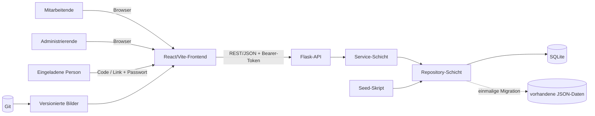
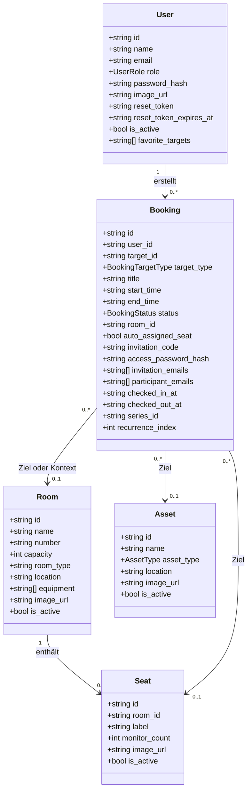
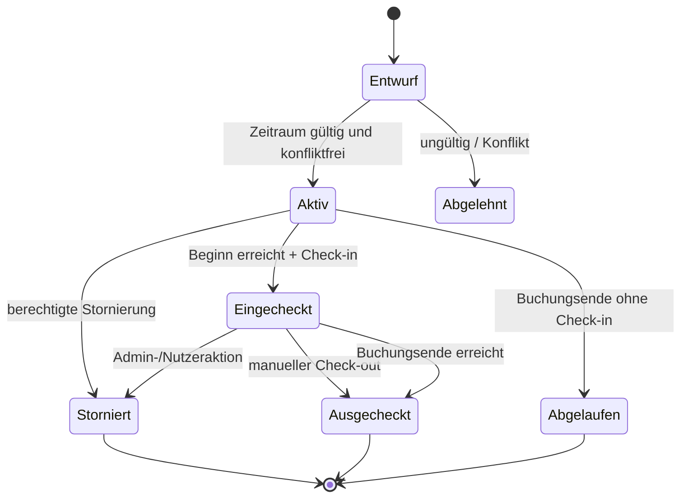
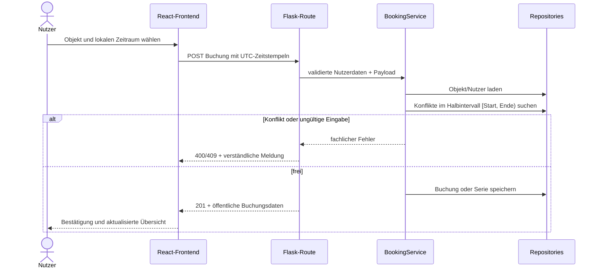

# UML- und Architekturübersicht RePlan

**Stand:** 28.07.2026
**Bezug:** aktueller Fullstack-Prototyp auf Basis von Flask, React/Vite und SQLite

## 1. Systemkontext

Ein externer E-Mail-Dienst gehört bewusst nicht zum Prototyp. Einladungslinks, Einladungscodes und Passwörter werden manuell weitergegeben; Benachrichtigungen bleiben innerhalb der Anwendung.

## 2. Schichtenmodell

| Schicht | Verzeichnis | Verantwortung |
| --- | --- | --- |
| Präsentation | `frontend/src/` | Navigation, Formulare, Zeit- und Sitzplanansichten, Dark Mode und API-Aufrufe |
| HTTP/API | `app.py`, `src/routes/` | Flask-Blueprints, Eingabeprüfung, Authentifizierung und HTTP-Statuscodes |
| Geschäftslogik | `src/services/` | Buchungsregeln, Konflikte, Einladungen, Serien, Anwesenheit, Nutzer- und Admin-Abläufe |
| Domäne | `src/models/` | Dataclasses und Enums für User, Room, Seat, Asset und Booking |
| Datenzugriff | `src/repositories/` | Einheitliche CRUD-Schnittstellen und Such-/Konfliktabfragen |
| Persistenz | `data/replan.sqlite`, JSON-Migration | Lokale Demo-Datenhaltung; Datenbankdatei wird nicht in Git versioniert |

## 3. Domänenmodell

`Booking.target_type` bestimmt, ob `target_id` auf einen Raum, Sitzplatz oder ein Asset verweist. Bei Sitzplatzbuchungen speichert `room_id` zusätzlich den Shared-Office-Kontext.

## 4. Buchungs- und Anwesenheitsablauf

Wichtig: Der persistierte Buchungsstatus unterscheidet `active` und `cancelled`. Eingecheckt/ausgecheckt wird über Zeitstempel modelliert. Die Oberfläche berechnet daraus den aktuellen Anwesenheits- und Verfügbarkeitszustand.

## 5. Sequenz: Buchung erstellen

## 6. Sicherheits- und Datenentscheidungen

- Passwörter und Buchungspasswörter werden ausschließlich als Hash gespeichert.
- API-Zugriffe verwenden signierte, zeitlich begrenzte Bearer-Tokens.
- Rollenprüfungen erfolgen im Backend; die Oberfläche allein entscheidet nicht über Berechtigungen.
- `SECRET_KEY` muss außerhalb der lokalen Demo als Umgebungsvariable gesetzt werden.
- Datum und Uhrzeit werden an der Browsergrenze eindeutig übertragen und backendseitig normalisiert; die Anzeige erfolgt in der konfigurierten lokalen Zeitzone.
- Bilder und Seed-Definitionen sind versioniert, `data/replan.sqlite` sowie Laufzeit- und Nutzerdaten nicht.

## 7. Architekturgrenzen

Die SQLite-Schicht speichert Repository-Datensätze generisch und ist damit für den lokalen Prototyp geeignet. Ein produktives System sollte daraus normalisierte SQL-Tabellen, echte Migrationen, einen externen Maildienst, serverseitig verwaltete Token-Sperrung und eine Deployment-Konfiguration entwickeln.
