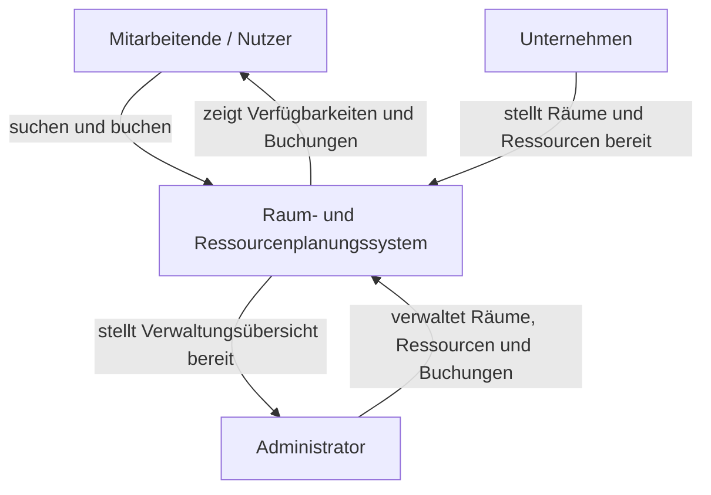

# Konzeptionsplan

## Projekt: Entwicklung einer Raum- und Ressourcenplanungs-App

## Projektziel

Ziel des Projekts ist die Konzeption, Planung und prototypische Umsetzung einer webbasierten Raum- und Ressourcenplanungs-App.
Die Anwendung soll es ermöglichen, Räume und Ressourcen wie Beamer, Laptops oder Arbeitsplätze effizient zu verwalten, Verfügbarkeiten zu prüfen und Buchungen konfliktfrei durchzuführen.

Im Vordergrund steht dabei nicht nur die technische Umsetzung, sondern insbesondere ein strukturierter **Software-Engineering-Prozess**.
Dazu gehören die systematische Anforderungsanalyse, saubere Modellierung, Planung der Architektur, Priorisierung der Arbeitspakete, Sprint-Planung, Qualitätssicherung sowie nachvollziehbare Dokumentation.

---

## 1. Kickoff / Organisatorisches / Themenauswahl / Projektrollen

### Ziel der Phase

In der Kickoff-Phase wird der organisatorische und methodische Rahmen des Projekts geschaffen.
Hierbei wird das Thema verbindlich festgelegt, die Projektziele werden grob definiert und erste Rollen und Verantwortlichkeiten werden verteilt.

### Inhalte

- Abstimmung des Projektrahmens
- Festlegung des Themas: Raum- und Ressourcenplanungs-App
- Definition des grundsätzlichen Projektziels
- Klärung organisatorischer Rahmenbedingungen
- Grobe Zeit- und Meilensteinplanung
- Festlegung des Entwicklungs- und Kommunikationsprozesses

### Begründung der Themenwahl

Die Wahl des Themas erfolgt, weil es sich um ein praxisnahes und klar eingrenzbares Problem handelt, das typische Herausforderungen des Software Engineerings abbildet:

- Erhebung und Strukturierung von Anforderungen
- Modellierung fachlicher Prozesse
- Konfliktbehandlung bei Buchungen
- Planung eines skalierbaren und wartbaren Systems
- Testbarkeit der Geschäftslogik
- Nachvollziehbare Dokumentation von Entscheidungen

Das Thema eignet sich daher besonders gut für eine Fallstudie mit Software-Engineering-Schwerpunkt.

### Organisatorische Grundlagen

- Gemeinsames Repository anlegen: erfolgt am 13.04.2026
- Branching-Strategie definieren: erfolgt am 13.04.2026
- Kommunikationskanäle festlegen: noch abzustimmen
- Meeting-Rhythmus abstimmen: noch abzustimmen
- Definition von Arbeitsweise und Abstimmungsformaten: noch abzustimmen

### Vorgesehene Projektrollen

Die Rollen dienen in erster Linie der Strukturierung und Verantwortung, können je nach Teamgröße kombiniert werden.

| Rolle | Verantwortliche Person | Aufgaben |
|---|---|---|
| Projektmanagement | Florian Haentjes | Terminüberwachung, Pflege des Zeitplans, Koordination von Meetings, Nachverfolgung offener Aufgaben, Sicherstellung des Projektfortschritts |
| Scrum Master | Tim-Oliver Strauß | Sprint Planning, Review, Retrospective, Unterstützung des iterativen Vorgehens |
| Requirements Engineering / Dokumentation | Alexander Vetrenko | Sammlung und Strukturierung von Anforderungen, Use Cases, User Stories, Anforderungskatalog, Dokumentation fachlicher Entscheidungen |
| Software-Architektur / Systemdesign | gesamtes Team | Entwurf der Systemarchitektur, Modellierung von Komponenten und Datenstrukturen, Definition technischer Schnittstellen |
| Backend-Entwicklung | gesamtes Team | Umsetzung der Kernfunktionalitäten, Geschäftslogik, Buchungslogik, Schnittstellen |
| Frontend-Entwicklung / UX | Denis Nickel | Benutzeroberfläche, Nutzerführung, Darstellung der Buchungen |
| Qualitätssicherung / Testing | Denis Nickel | Testplanung, Testfälle, Funktionstests, Code Reviews, Fehlerprüfung |

> Hinweis: Die Rollen dienen als Hauptverantwortlichkeiten. Die Umsetzung erfolgt gemeinsam im Team.

### Erste Projektmanagement-Entscheidungen

- Iteratives Vorgehen in drei Sprints
- Fokus auf MVP (Minimum Viable Product) und schrittweise Erweiterung
- Frühe Priorisierung zentraler Funktionen
- Kontinuierliche Dokumentation statt Dokumentation erst am Ende
- Arbeitspakete werden zusätzlich als GitHub Issues dokumentiert
- Die Arbeitsteilung wird in `TASKS.md` festgehalten

---

## 2. Finalisierung Thema / Stakeholderanalyse / Anforderungskatalog / Projektmanagement

### Ziel der Phase

In dieser Phase wird das Projektthema fachlich präzisiert.
Der Fokus liegt auf dem Verständnis des Anwendungsproblems, der Identifikation relevanter Stakeholder sowie der Erstellung eines ersten strukturierten Anforderungskatalogs.

### Finalisierung des Themas

Die Raum- und Ressourcenplanungs-App soll ein System bereitstellen, das:

- Räume verwaltbar macht
- Ressourcen erfassbar macht
- Buchungen ermöglicht
- Konflikte erkennt und verhindert
- Verfügbarkeiten transparent darstellt
- eine einfache Rollen- und Rechteverteilung unterstützt
- Nutzern eine Übersicht über eigene Buchungen bietet
- Administratoren eine zentrale Verwaltungsoberfläche bereitstellt
- eine nachvollziehbare und benutzerfreundliche Planung ermöglicht

### Ausgangssituation / Problemstellung

In vielen Unternehmen werden Räume, Arbeitsplätze und Ressourcen über verschiedene Kanäle wie E-Mail, Kalender, Tabellen oder persönliche Absprachen verwaltet.
Dadurch können Doppelbuchungen, unklare Zuständigkeiten oder unnötiger organisatorischer Aufwand entstehen.

Typische Probleme sind:

- Doppelbuchungen
- fehlende Transparenz
- ineffiziente Nutzung vorhandener Ressourcen
- hoher manueller Abstimmungsaufwand
- unklare Zuständigkeiten
- fehlende zentrale Übersicht über verfügbare Kapazitäten

Die App soll diesen Prozess strukturieren und digital abbilden.

### Zielgruppe

Die Anwendung richtet sich an Unternehmen, die Räume, Arbeitsplätze und Ressourcen intern planen und verwalten möchten.

Die wichtigsten Nutzergruppen sind:

- Mitarbeitende, die Räume oder Ressourcen buchen möchten
- Administratoren, die Räume, Ressourcen und Buchungen verwalten
- Unternehmen bzw. Abteilungen, die eine bessere Übersicht über verfügbare Kapazitäten benötigen

### Auftraggeber

Der Auftraggeber bzw. Kunde ist im Rahmen der Fallstudie der Dozent. Das Entwicklungsteam der Gruppe 03 setzt die Anforderungen im Rahmen des Software-Engineering-Projekts um.

### Stakeholderanalyse

| Stakeholder | Interesse / Erwartung |
|---|---|
| Mitarbeitende / Nutzerinnen und Nutzer | möchten schnell und einfach Räume oder Ressourcen finden und buchen |
| Administratoren / Facility Management | möchten Räume, Ressourcen und Buchungen zentral verwalten |
| Unternehmen / Abteilungen | möchten Ressourcen effizient nutzen und organisatorischen Aufwand reduzieren |
| IT-Abteilung | erwartet eine wartbare, nachvollziehbare und sicher betreibbare Anwendung |
| Entwicklungsteam | benötigt klare Anforderungen, stabile Planung und sinnvolle Abgrenzung des Projektumfangs |
| Dozent / Kunde | erwartet ein nachvollziehbares Projekt mit Anforderungen, Umsetzung, Dokumentation und lauffähiger Software |
| Lehrende / Prüfende | bewerten nicht nur das Produkt, sondern auch den Entwicklungsprozess |

### Stakeholder-Erwartungen

- funktionierende Kernlogik
- konfliktfreie Buchungsverwaltung
- nachvollziehbare Planung
- saubere Dokumentation
- softwaretechnisch begründete Entscheidungen
- einfache Bedienbarkeit
- transparente Verfügbarkeit von Räumen und Ressourcen

### Kontextdiagramm

---

## 3. Lastenheft / Grobanforderungen

Das Lastenheft beschreibt die fachlichen Erwartungen an die Raum- und Ressourcenplanungs-App auf einer groben Ebene. Es dient als Grundlage für die spätere Detaillierung in Use Cases, User Stories, Issues und Sprint-Aufgaben.

Die Anforderungen in diesem Abschnitt orientieren sich am Konzeptionsplan und nicht am ursprünglich im README enthaltenen Lastenheft.

### Funktionale Anforderungen

Die Anwendung soll folgende grundlegende Funktionen bereitstellen:

- Räume sollen im System verwaltet werden können.
- Ressourcen wie Beamer, Laptops, Whiteboards, Monitore oder Arbeitsplätze sollen im System erfassbar sein.
- Nutzer sollen Räume und Ressourcen anzeigen können.
- Nutzer sollen Verfügbarkeiten für bestimmte Zeiträume prüfen können.
- Nutzer sollen Räume oder Ressourcen für einen bestimmten Zeitraum buchen können.
- Das System soll Buchungskonflikte erkennen.
- Das System soll Doppelbuchungen verhindern.
- Nutzer sollen eine Übersicht über eigene Buchungen erhalten.
- Buchungen sollen storniert werden können.
- Administratoren sollen Räume, Ressourcen und Buchungen verwalten können.
- Das System soll eine einfache Rollen- und Rechteverteilung unterstützen.
- Verfügbarkeiten sollen transparent und nachvollziehbar dargestellt werden.
- Die wichtigsten Abläufe sollen über eine Weboberfläche bedienbar sein.

### Nicht-funktionale Anforderungen

Die Anwendung soll neben den fachlichen Funktionen auch grundlegende Qualitätsanforderungen erfüllen:

- Die Anwendung soll einfach und verständlich bedienbar sein.
- Die Benutzeroberfläche soll übersichtlich aufgebaut sein.
- Buchungsvorgänge sollen nachvollziehbar und konfliktfrei ablaufen.
- Fehlermeldungen sollen verständlich formuliert sein.
- Die Geschäftslogik, insbesondere die Konfliktprüfung, soll testbar sein.
- Der Quellcode soll wartbar und nachvollziehbar strukturiert sein.
- Architektur, Anforderungen und Entscheidungen sollen dokumentiert werden.
- Die Anwendung soll im Rahmen des Projekts realistisch umsetzbar bleiben.
- Der MVP soll stabiler und sauberer umgesetzt werden als ein zu großer Funktionsumfang.
- Die Installation und Ausführung sollen im README beschrieben werden.

### Projektmanagement-Schwerpunkte in dieser Phase

- Projektumfang bewusst klein und realistisch halten
- MVP früh definieren
- frühe Identifikation technischer Risiken
- Planung nicht nur nach Features, sondern auch nach Engineering-Aufgaben strukturieren

### Ergebnisse der Phase

- Thema fachlich finalisiert
- Stakeholder identifiziert
- erste Anforderungen dokumentiert
- Projektumfang grob eingegrenzt
- Lastenheft auf Basis des Konzeptionsplans ergänzt

---

## 4. Detaillierte Anforderungen / Use Cases / Issues & Priorisierung

### Ziel der Phase

Die Anforderungen werden verfeinert und in konkrete Anwendungsfälle und bearbeitbare Arbeitspakete überführt.
Diese Phase ist zentral für den Software-Engineering-Fokus, da hier die Grundlage für Architektur, Implementierung und Tests geschaffen wird.

### Fachliche Kernobjekte

#### Nutzer

Ein Nutzer verwendet das System, um Räume oder Ressourcen zu suchen, zu buchen und eigene Buchungen zu verwalten.

Mögliche Attribute:

- Nutzer-ID
- Name
- E-Mail-Adresse
- Rolle
- Passwort bzw. Authentifizierungsinformation

#### Raum

Ein Raum ist ein buchbarer Ort, z. B. Meetingraum, Konferenzraum, Arbeitsplatz oder Schulungsraum.

Mögliche Attribute:

- Raum-ID
- Raumname
- Raumnummer
- Kapazität
- Standort
- Ausstattung
- Beschreibung
- Verfügbarkeit

Beispiel: `Raum 1001, Platz 23 [1001-23]`

#### Ressource

Eine Ressource ist ein buchbares Objekt, z. B. Beamer, Whiteboard, Laptop, Monitor, Adapter, Moderationsmaterial oder Präsentationstechnik.

Mögliche Attribute:

- Ressourcen-ID
- Name
- Typ
- Beschreibung
- Standort
- Verfügbarkeit

#### Buchung

Eine Buchung reserviert einen Raum oder eine Ressource für einen bestimmten Zeitraum.

Mögliche Attribute:

- Buchungs-ID
- Nutzer-ID
- Raum-ID oder Ressourcen-ID
- Startzeit
- Endzeit
- Status
- Erstellungsdatum

### Use Cases

#### Use Case 1: Raum suchen

Ein Nutzer möchte einen freien Raum für einen bestimmten Zeitraum finden.

**Ablauf**

1. Nutzer gibt Zeitraum ein.
2. System prüft Verfügbarkeit.
3. System zeigt passende Räume an.

**Ergebnis**

Der Nutzer erhält eine Übersicht über Räume, die im gewählten Zeitraum verfügbar sind.

#### Use Case 2: Ressource buchen

Ein Nutzer möchte eine Ressource für einen bestimmten Zeitraum reservieren.

**Ablauf**

1. Nutzer wählt Ressource.
2. System prüft Verfügbarkeit.
3. System erstellt Buchung.
4. System bestätigt Buchung.

**Ergebnis**

Die Ressource ist für den gewählten Zeitraum reserviert.

#### Use Case 3: Konflikt verhindern

Ein Nutzer versucht, einen bereits gebuchten Raum zu reservieren.

**Ablauf**

1. Nutzer startet Buchung.
2. System erkennt Überschneidung.
3. System lehnt Buchung ab.
4. System zeigt Hinweis an.

**Ergebnis**

Die Doppelbuchung wird verhindert und der Nutzer erhält eine verständliche Fehlermeldung.

#### Use Case 4: Eigene Buchung stornieren

Ein Nutzer möchte eine nicht mehr benötigte Buchung stornieren.

**Ablauf**

1. Nutzer öffnet die Übersicht eigener Buchungen.
2. Nutzer wählt eine Buchung aus.
3. Nutzer storniert die Buchung.
4. System gibt den Raum oder die Ressource wieder frei.

**Ergebnis**

Die Buchung ist storniert und die Verfügbarkeit wird aktualisiert.

#### Use Case 5: Raum oder Ressource administrativ verwalten

Ein Administrator möchte Räume oder Ressourcen anlegen, bearbeiten oder löschen.

**Ablauf**

1. Administrator öffnet den geschützten Admin-Bereich.
2. Administrator wählt Raum- oder Ressourcenverwaltung aus.
3. Administrator legt einen Eintrag an, bearbeitet ihn oder löscht ihn.
4. System speichert die Änderung.

**Ergebnis**

Die Stammdaten sind aktualisiert.

### User Stories

Die Anforderungen werden zusätzlich als GitHub Issues gepflegt. Erste User Stories:

1. Als Nutzer möchte ich mich anmelden können, damit meine Buchungen meinem Profil zugeordnet werden.
2. Als Nutzer möchte ich verfügbare Räume anzeigen können, damit ich einen passenden Raum finde.
3. Als Nutzer möchte ich Räume nach Datum und Uhrzeit suchen können, damit ich nur verfügbare Räume sehe.
4. Als Nutzer möchte ich einen Raum buchen können, damit ich ihn für ein Meeting reservieren kann.
5. Als Nutzer möchte ich Ressourcen buchen können, damit ich benötigte Ausstattung reservieren kann.
6. Als Nutzer möchte ich meine eigenen Buchungen einsehen können, damit ich den Überblick behalte.
7. Als Nutzer möchte ich meine Buchungen stornieren können, damit ich nicht mehr benötigte Reservierungen freigeben kann.
8. Als Administrator möchte ich Räume anlegen, bearbeiten und löschen können, damit die Raumdaten aktuell bleiben.
9. Als Administrator möchte ich Ressourcen anlegen, bearbeiten und löschen können, damit die Ressourcendaten aktuell bleiben.
10. Als Administrator möchte ich alle Buchungen einsehen können, damit ich die Auslastung kontrollieren kann.
11. Als System möchte ich Doppelbuchungen verhindern, damit Räume und Ressourcen nicht mehrfach zur gleichen Zeit reserviert werden.
12. Als Nutzer möchte ich verständliche Fehlermeldungen erhalten, damit ich fehlerhafte Eingaben korrigieren kann.

### Abgrenzung des MVP

Der MVP konzentriert sich auf die zentralen Kernfunktionen:

- Anzeige von Räumen und Ressourcen
- Erstellung von Buchungen
- Konfliktprüfung
- Stornierung von Buchungen
- eigene Buchungen anzeigen
- einfache Administrationsfunktionen
- grundlegende Such- und Filterfunktionen nach Datum und Uhrzeit
- Browserbasierte Bedienung
- dokumentierte Installation
- grundlegende Tests für die Buchungslogik

Nicht Teil des MVP:

- komplexes Rollen- und Rechtesystem
- Benachrichtigungen per E-Mail
- Kalender-Synchronisierung
- Mehrsprachigkeit
- Optimierungsalgorithmen
- Echtzeit-Kollaboration
- Single-Sign-On
- Abrechnungssysteme
- mobile App
- erweiterte Statistiken zur Raumauslastung

### Priorisierung der Anforderungen

#### Muss-Anforderungen

- Nutzer können Räume anzeigen.
- Nutzer können Räume buchen.
- Nutzer können eigene Buchungen einsehen.
- Administratoren können Räume verwalten.
- Das System verhindert Doppelbuchungen.
- Die Anwendung ist über den Browser nutzbar.
- Die Installation ist dokumentiert.

#### Soll-Anforderungen

- Nutzer können Ressourcen buchen.
- Nutzer können eigene Buchungen stornieren.
- Administratoren können Ressourcen verwalten.
- Such- und Filterfunktionen sind vorhanden.
- Es gibt grundlegende Tests.

#### Kann-Anforderungen

- Kalenderansicht für Buchungen
- Exportfunktion für Buchungsübersichten
- Benachrichtigungen bei Buchungen oder Änderungen
- Erweiterte Statistiken zur Raumauslastung
- Responsive Optimierung für mobile Geräte

### Issues und Arbeitspakete

Die Anforderungen werden in technische und fachliche Issues überführt.

#### Beispielhafte fachliche Issues

- Anforderungen für Raumverwaltung erfassen
- Anforderungen für Ressourcenverwaltung erfassen
- User Stories für Buchungsverwaltung formulieren
- MVP-Abgrenzung dokumentieren
- Abnahmekriterien für Kernfunktionen festlegen
- Fehlermeldungen und Validierungsregeln beschreiben

#### Beispielhafte technische Issues

- Projektstruktur anlegen
- Datenmodell für Nutzer, Räume, Ressourcen und Buchungen erstellen
- Buchungslogik implementieren
- Konfliktprüfung für Zeitüberschneidungen implementieren
- Admin-Bereich vorbereiten
- Tests für Doppelbuchungen schreiben
- README mit Setup-Anleitung aktualisieren
- `requirements.txt` pflegen

### Priorisierung der Issues

Die Priorisierung erfolgt nach:

- fachlicher Relevanz
- Abhängigkeiten
- Risiko
- Umsetzbarkeit im Zeitrahmen
- Beitrag zum MVP

#### Priorität Hoch

- Datenmodell definieren
- Räume anzeigen
- Räume buchen
- Buchungen speichern
- Doppelbuchungen verhindern
- eigene Buchungen anzeigen
- grundlegende Tests der Buchungslogik
- Setup und Start der Anwendung dokumentieren

#### Priorität Mittel

- Ressourcen buchen
- Ressourcen administrativ verwalten
- Buchungen stornieren
- Such- und Filterfunktionen ergänzen
- Admin-Übersicht verbessern
- Fehlermeldungen nutzerfreundlich gestalten

#### Priorität Niedrig

- Kalenderansicht
- Exportfunktion
- Benachrichtigungen
- erweiterte Statistiken
- Responsive Optimierung
- zusätzliche Komfortfunktionen

### Risiken

| Risiko | Auswirkung | Gegenmaßnahme |
|---|---|---|
| Doppelbuchungen werden nicht korrekt verhindert | hohe Fehleranfälligkeit im Kernprozess | Buchungslogik früh entwickeln und testen |
| Zu großer Funktionsumfang | Projekt wird nicht rechtzeitig fertig | Muss-, Soll- und Kann-Anforderungen priorisieren |
| Unklare Aufgabenverteilung | Verzögerungen im Team | Rollen und Aufgaben in `TASKS.md` festhalten |
| Technische Probleme bei der Installation | Anwendung läuft nicht auf anderen Rechnern | `requirements.txt` und Setup-Anleitung pflegen |
| Fehlende Tests | Fehler bleiben unentdeckt | zentrale Funktionen mit `pytest` testen |

### Software-Engineering-Schwerpunkt

In dieser Phase steht besonders im Fokus:

- präzise Übersetzung fachlicher Anforderungen in technische Aufgaben
- Vermeidung von Scope Creep
- Nachvollziehbarkeit von Priorisierungsentscheidungen
- Vorbereitung einer testbaren und wartbaren Umsetzung

### Ergebnisse der Phase

- detaillierte Anforderungen liegen vor
- Use Cases dokumentiert
- User Stories formuliert
- Issues erstellt
- MVP klar priorisiert
- Risiken identifiziert und Gegenmaßnahmen definiert

---

## 5. Sprint I

### Ziel des Sprints

Sprint I konzentriert sich auf die konzeptionelle und technische Grundlage des Systems.
Im Vordergrund stehen Architektur, Modellierung, Entwicklungsprozess und erste Basiskomponenten.

### Schwerpunkte

- Abschluss der Planungsphase
- Festlegung der Systemarchitektur
- Modellierung zentraler Entitäten
- Einrichtung des Entwicklungsprozesses
- Vorbereitung eines lauffähigen Grundgerüsts

### Geplante Inhalte

#### Architektur und Systemdesign

- Auswahl des Technologie-Stacks
- Definition der Schichtenarchitektur
- Trennung von UI, Fachlogik und Datenhaltung
- Planung zentraler Komponenten
- erste Architekturübersicht erstellen

#### Datenmodellierung

- Modellierung der Entitäten Raum, Ressource, Buchung und Nutzer
- Beziehungen zwischen den Entitäten definieren
- Validierungsregeln festlegen

#### Entwicklungsprozess

- Branching-Modell definieren
- Pull-Request-Regeln festlegen
- Definition von Code-Review-Vorgehen
- Definition von Commit-Konventionen
- Issue-Workflow festlegen

#### Qualitätssicherung vorbereiten

- Teststrategie definieren
- zentrale Testfälle identifizieren
- Kriterien für Abnahme des MVP formulieren

### Geplante Ergebnisse von Sprint I

- Architekturkonzept liegt vor
- Datenmodell ist definiert
- Repository-Struktur ist eingerichtet
- erste technische Grundlage ist vorhanden
- Kernanforderungen sind stabil dokumentiert

### Review-Kriterien

- Sind Anforderungen und Architektur konsistent?
- Ist der MVP realistisch abgegrenzt?
- Sind die zentralen Entitäten und Abläufe korrekt modelliert?
- Ist das Projekt organisatorisch und technisch bereit für die Umsetzung?

---

## 6. Sprint II

### Ziel des Sprints

Sprint II dient der Umsetzung der wichtigsten Kernfunktionen des Systems.
Der Schwerpunkt liegt auf der Implementierung des MVP und der Absicherung der zentralen Geschäftslogik.

### Schwerpunkte

- Implementierung der Kernfunktionalitäten
- Aufbau der Buchungslogik
- Umsetzung der Konfliktprüfung
- Erstellung erster Tests
- erste integrierte, lauffähige Systemversion

### Geplante Inhalte

#### Implementierung

- Ansicht für Räume und Ressourcen
- Buchungsformular
- Erstellen von Buchungen
- Speichern und Anzeigen bestehender Buchungen
- Validierung von Eingaben

#### Konflikt- und Fachlogik

- Überschneidungen bei Zeiträumen prüfen
- Verhinderung von Doppelbuchungen
- Behandlung ungültiger Buchungszeiträume
- Stornierung und Aktualisierung von Buchungen

#### Testing

- Unit-Tests für Konfliktprüfung
- Tests für Validierungsregeln
- manuelle Funktionstests für Kernabläufe

#### Dokumentation

- Fortschreibung der Architektur
- Dokumentation technischer Entscheidungen
- Beschreibung bekannter Einschränkungen

### Geplante Ergebnisse von Sprint II

- MVP ist in wesentlichen Teilen umgesetzt
- zentrale Kernlogik funktioniert
- erste Tests liegen vor
- System ist demonstrierbar

### Review-Kriterien

- Funktionieren die Kernabläufe stabil?
- Werden Konflikte zuverlässig erkannt?
- Entspricht die Umsetzung den Anforderungen?
- Ist die Lösung strukturell wartbar?

---

## 7. Sprint III

### Ziel des Sprints

Sprint III fokussiert sich auf Stabilisierung, Qualitätssicherung, Refactoring und Abschluss der produktnahen Funktionen.
Hier steht Software Engineering besonders stark im Vordergrund, da nicht nur Features ergänzt, sondern Qualität und Wartbarkeit gesichert werden.

### Schwerpunkte

- Refactoring
- Erweiterung von Tests
- Fehlerbehebung
- Verbesserung der Bedienbarkeit
- Vorbereitung der finalen Dokumentation und Präsentation

### Geplante Inhalte

#### Qualitätsverbesserung

- Code aufräumen und vereinheitlichen
- redundante Logik reduzieren
- Struktur und Lesbarkeit verbessern
- Namensgebung und Modulgrenzen überprüfen

#### Testing und Validierung

- weitere Unit-Tests ergänzen
- Integration zentraler Komponenten prüfen
- Randfälle testen
- Fehlerprotokoll führen und beheben

#### Funktionale Ergänzungen

- Administrationsfunktionen abrunden
- Buchungsübersichten verbessern
- kleinere UX-Verbesserungen umsetzen

#### Engineering-Reflexion

- Abgleich zwischen Planung und tatsächlicher Umsetzung
- Bewertung getroffener Architekturentscheidungen
- Analyse von Abweichungen, Risiken und Lessons Learned

### Geplante Ergebnisse von Sprint III

- stabile und präsentierbare Systemversion
- verbesserte Testabdeckung
- dokumentierte Qualitätsmaßnahmen
- nachvollziehbare Reflexion des Entwicklungsprozesses

### Review-Kriterien

- Ist das System stabil genug für Demonstration und Bewertung?
- Wurden zentrale Qualitätsziele erreicht?
- Sind Architektur und Code nachvollziehbar dokumentiert?
- Lassen sich Entscheidungen softwaretechnisch begründen?

---

## 8. Finalisierung System & Dokumentation

### Ziel der Phase

In der Finalisierungsphase werden System, Dokumentation und Präsentationsmaterial vollständig abgeschlossen.
Neben der letzten Qualitätssicherung steht vor allem die strukturierte Darstellung des Software-Engineering-Prozesses im Vordergrund.

### Inhalte

#### Technische Finalisierung

- letzte Fehlerbehebungen
- Abschluss offener Issues
- Endkontrolle des Systems
- finale Testdurchläufe

#### Dokumentation

- Überarbeitung des Anforderungskatalogs
- finale Beschreibung der Architektur
- Dokumentation der Use Cases
- Dokumentation von Testfällen und Ergebnissen
- Reflexion des Projektverlaufs
- Lessons Learned

#### Fokus auf Software Engineering

Die Dokumentation soll deutlich machen:

- wie Anforderungen systematisch erhoben wurden
- wie aus Anforderungen technische Arbeitspakete entstanden
- wie Architekturentscheidungen getroffen wurden
- wie Qualität gesichert wurde
- wie Planung und Umsetzung miteinander verzahnt waren

#### Präsentationsvorbereitung

- Erstellung einer klaren Projektvorstellung
- Visualisierung der Systemarchitektur
- Vorbereitung eines Demo-Ablaufs
- Verteilung der Vortragsanteile im Team

### Abschließende Artefakte

- fertiges System bzw. funktionsfähiger Prototyp
- Konzeptionsplan
- Anforderungskatalog
- Use Cases
- Architekturübersicht
- Testdokumentation
- Präsentationsunterlagen

---

## 9. Resultate / Vorstellung

### Termin

**Freitag, 16.05.2025, 09:00 – 12:15 Uhr**

### Ziel der Vorstellung

Die Vorstellung soll nicht nur das Endprodukt zeigen, sondern insbesondere den Entwicklungs- und Planungsprozess aus Sicht des Software Engineerings nachvollziehbar machen.

### Inhalte der Abschlussvorstellung

- Problemstellung und Motivation
- Ziel des Projekts
- Stakeholder und Anforderungen
- MVP und Priorisierung
- Architektur und Systementwurf
- wichtigste Kernfunktionen
- Teststrategie und Qualitätssicherung
- Reflexion des Projektverlaufs
- Lessons Learned

### Erwartete Resultate

- nachvollziehbar geplantes Projekt
- prototypisch umgesetzte Raum- und Ressourcenplanungs-App
- klar dokumentierter Software-Engineering-Prozess
- begründete Entscheidungen zu Architektur, Planung und Umsetzung
- erkennbare Verbindung zwischen Anforderungen, Design, Implementierung und Tests

### Abschließende Reflexion

Ein zentrales Ergebnis des Projekts soll sein, dass gezeigt wird, wie ein vergleichsweise kleines Softwaresystem mit Methoden des Software Engineerings strukturiert geplant, entwickelt und bewertet werden kann.
Der fachliche Mehrwert liegt daher nicht allein in der App selbst, sondern vor allem in der nachvollziehbaren Anwendung von Software-Engineering-Prinzipien.

---

## 10. Ergänzende Planungsgrundsätze

### Projektabgrenzung

Das Projekt wird bewusst in einem realistischen Rahmen gehalten.
Komplexität wird nur dort aufgebaut, wo sie fachlich oder softwaretechnisch sinnvoll ist.

Das System ist kein vollständiges Enterprise-Resource-Planning-System. Der Fokus liegt auf der Verwaltung und Buchung von Räumen, Arbeitsplätzen und Ressourcen.

### MVP-orientiertes Vorgehen

Zunächst werden die Funktionen umgesetzt, die für die Kernidee des Systems unverzichtbar sind.
Erweiterungen erfolgen nur dann, wenn der MVP stabil ist.

### Dokumentation als kontinuierlicher Prozess

Dokumentation wird nicht erst zum Schluss erstellt, sondern in allen Projektphasen fortlaufend gepflegt.

### Qualität vor Funktionsumfang

Da der Schwerpunkt auf Software Engineering liegt, ist eine kleinere, aber sauber geplante und gut dokumentierte Lösung wertvoller als ein überladener, instabiler Prototyp.

### Nachvollziehbarkeit von Entscheidungen

Wichtige Entscheidungen zu Anforderungen, Architektur, Priorisierung und Testing sollen stets begründet und dokumentiert werden.

