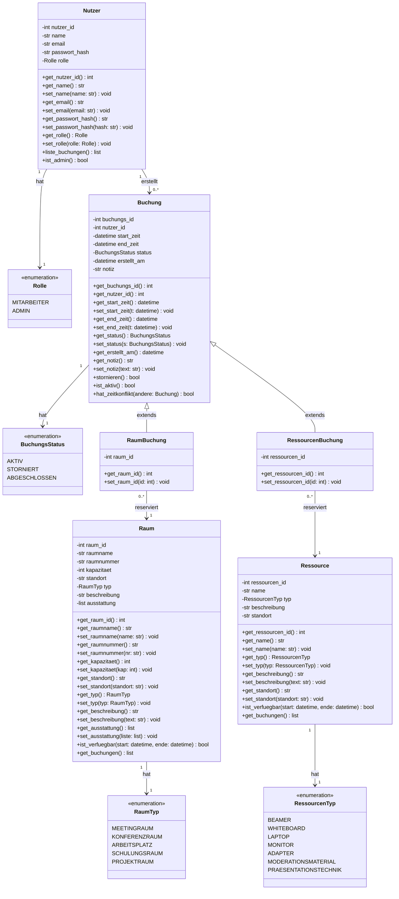
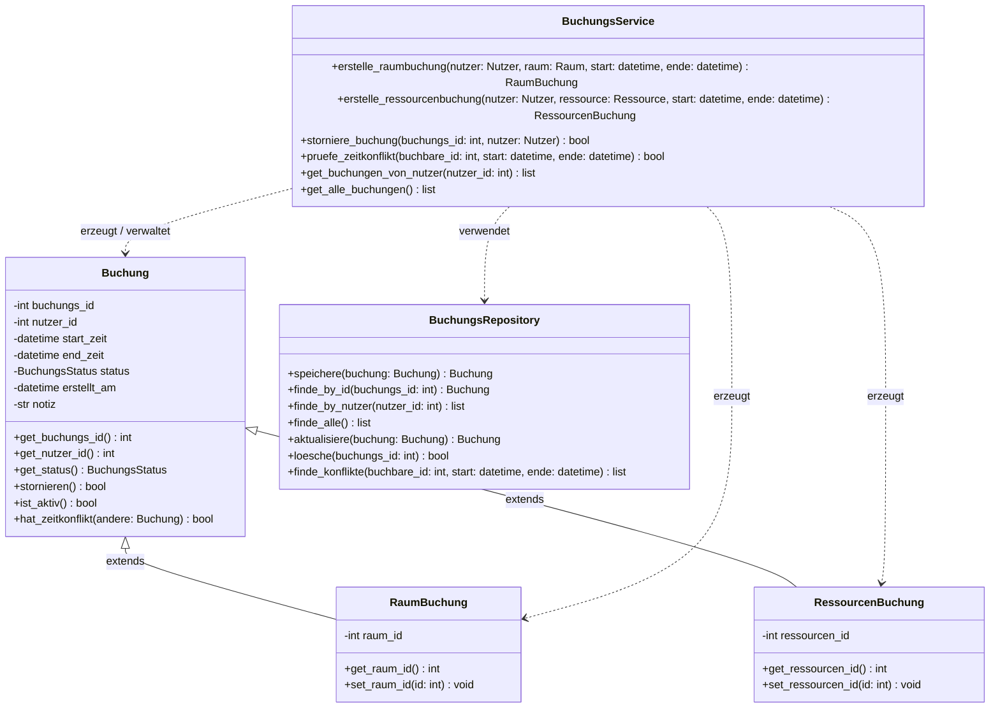
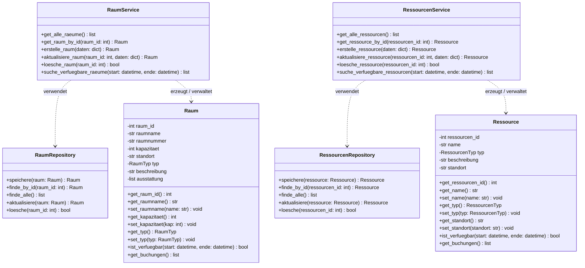
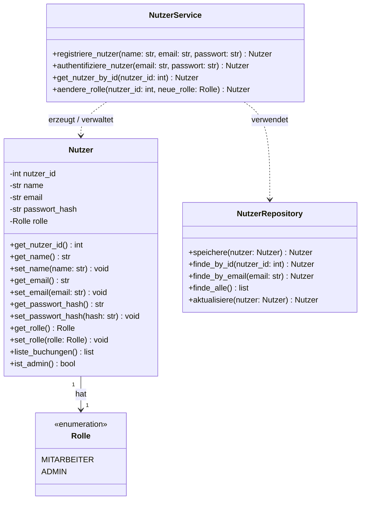

# UML – Klassendiagramm

## Raum- und Ressourcenplanungssystem (RePlan)

Das folgende Klassendiagramm modelliert die zentralen Entitäten und deren Beziehungen der webbasierten Raum- und Ressourcenplanungsanwendung.

Das Gesamtdiagramm ist aus Gründen der Übersichtlichkeit in **vier thematische Teildiagramme** aufgeteilt:

1. [Domänenmodell & Enumerationen](#1-domänenmodell--enumerationen)
2. [Buchungslogik](#2-buchungslogik)
3. [Raum- und Ressourcenverwaltung](#3-raum--und-ressourcenverwaltung)
4. [Nutzerverwaltung](#4-nutzerverwaltung)

---

## 1. Domänenmodell & Enumerationen

Zeigt alle Kernentitäten mit ihren Attributen sowie die verwendeten Enumerationen und deren Beziehungen untereinander.



---

## 2. Buchungslogik

Zeigt `BuchungsService` und `BuchungsRepository` sowie deren Abhängigkeiten zu den Buchungs-Entitäten.



---

## 3. Raum- und Ressourcenverwaltung

Zeigt `RaumService`, `RessourcenService` und deren jeweilige Repositories sowie die Entitäten `Raum` und `Ressource`.



---

## 4. Nutzerverwaltung

Zeigt `NutzerService`, `NutzerRepository` und die `Nutzer`-Entität mit der `Rolle`-Enumeration.



---

## Beschreibung der Klassen

### Entitäten (Models)

| Klasse | Beschreibung |
|---|---|
| `Nutzer` | Repräsentiert einen Systembenutzer. Kann Mitarbeiter (bucht) oder Admin (verwaltet) sein. |
| `Raum` | Ein buchbarer Ort (z. B. Meetingraum, Arbeitsplatz). Enthält Kapazität, Standort und Ausstattung. |
| `Ressource` | Ein buchbares Objekt (z. B. Beamer, Laptop). Enthält Typ und Standort. |
| `Buchung` | Abstrakte Basisklasse für alle Reservierungen. Hält Zeitraum, Status und Erstellungsdatum. |
| `RaumBuchung` | Spezialisierung von `Buchung` für die Reservierung eines Raums. |
| `RessourcenBuchung` | Spezialisierung von `Buchung` für die Reservierung einer Ressource. |

### Service-Schicht (Geschäftslogik)

| Klasse | Beschreibung |
|---|---|
| `BuchungsService` | Zentrale Geschäftslogik: Erstellt Buchungen, prüft Zeitkonflikte, storniert Buchungen. |
| `RaumService` | Verwaltungslogik für Räume (CRUD, Verfügbarkeitssuche). |
| `RessourcenService` | Verwaltungslogik für Ressourcen (CRUD, Verfügbarkeitssuche). |
| `NutzerService` | Authentifizierung, Registrierung und Rollenverwaltung. |

### Repository-Schicht (Datenzugriff)

| Klasse | Beschreibung |
|---|---|
| `BuchungsRepository` | Datenbankzugriff für Buchungen inkl. Konfliktabfrage. |
| `RaumRepository` | Datenbankzugriff für Räume. |
| `RessourcenRepository` | Datenbankzugriff für Ressourcen. |
| `NutzerRepository` | Datenbankzugriff für Nutzer (inkl. E-Mail-Suche). |

### Enumerationen

| Enum | Werte | Verwendung |
|---|---|---|
| `Rolle` | `MITARBEITER`, `ADMIN` | Steuert Zugriffsrechte im System. |
| `BuchungsStatus` | `AKTIV`, `STORNIERT`, `ABGESCHLOSSEN` | Lebenszyklus einer Buchung. |
| `RaumTyp` | `MEETINGRAUM`, `KONFERENZRAUM`, `ARBEITSPLATZ`, `SCHULUNGSRAUM`, `PROJEKTRAUM` | Kategorisierung von Räumen. |
| `RessourcenTyp` | `BEAMER`, `WHITEBOARD`, `LAPTOP`, `MONITOR`, `ADAPTER`, `MODERATIONSMATERIAL`, `PRAESENTATIONSTECHNIK` | Kategorisierung von Ressourcen. |

---

## Architekturprinzipien

Das Diagramm folgt einer **dreischichtigen Architektur**:

```
┌──────────────────────────┐
│    Routes / Controller   │  ← HTTP-Endpunkte (Flask/Web-Schicht)
├──────────────────────────┤
│      Service-Schicht     │  ← Geschäftslogik, Konfliktprüfung
├──────────────────────────┤
│    Repository-Schicht    │  ← Datenzugriff (DB / Datei)
├──────────────────────────┤
│     Model / Entitäten    │  ← Datenstrukturen der Fachdomäne
└──────────────────────────┘
```

- **Vererbung**: `RaumBuchung` und `RessourcenBuchung` erben von der abstrakten Basisklasse `Buchung`, um gemeinsame Attribute (Zeitraum, Status, Nutzer) zu teilen.
- **Konfliktprüfung**: `BuchungsService.pruefe_zeitkonflikt()` delegiert an `BuchungsRepository.finde_konflikte()`, um Doppelbuchungen systemseitig zu verhindern.
- **Rollenbasierter Zugriff**: Die `Rolle`-Enumeration auf `Nutzer` steuert, welche Operationen (z. B. Admin-CRUD) zulässig sind.
- **Getter/Setter**: Alle Attribute der Entitäten sind `private` (`-`) und werden über öffentliche (`+`) Getter- und Setter-Methoden zugegriffen, um das Kapselung-Prinzip (Encapsulation) einzuhalten.
